#architettura 

# Livello Logico Digitale

Livello 5 --> Livello *Linguaggio orientato al problema*.
Livello 4 --> Livello *Linguaggio Assemblativo*.
Livello 3 --> Livello *Macchina S.O.*.
Livello 2 --> Livello *Architettura dell'insieme delle istruzioni*.
Livello 1 --> Livello di *Mircroarchitettura*.
Livello 0 --> Livello *Logico Digitale*.   

Livello 4-5 vengono tradotti. 
Livello 3-2 vengono interpretati.

## Algebra di Boole

- L'algebra di boole si basa su un insieme B di 2 valori: (True = 1 , False = 0).

Su B si possono definire delle funzioni booleane: 
	*Unarie*: B --> B
	*Binarie*: BxB --> B
	*n-arie:* BxBx...xB --> B
Tali funzioni ricevono in input variabili logiche, le combinano e le restituiscono in output.
Tutte le possibili combinazioni sono esplorabili tramite la *Tavola di verità*.

## Proprietà dell'algebra di boole 

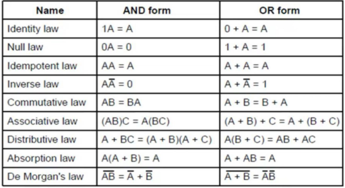

## Tipi di funzioni
### Funzioni Unarie

Le funzioni con 1 solo operando sono $2^2 =4$ 

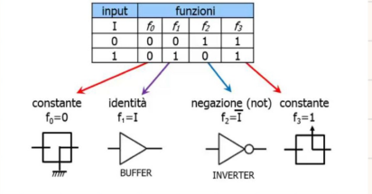

**Negazione**: La funzione inverte il valore della variabile in ingresso in un circuito digitale

### Funzioni Binarie

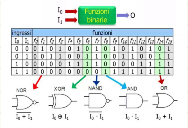

### Funzioni n-arie

Con n ingressi si hanno $2^n$ combinazioni e $2^n$ funzioni.

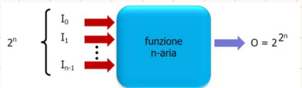

## Metodi per la verifica della validità di un'equivalenza

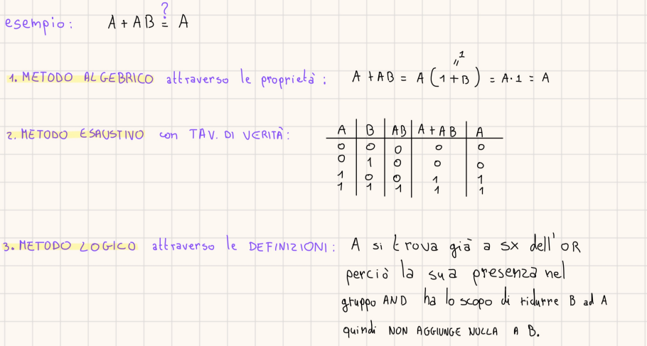

## Trasformazioni del dominio di Boole

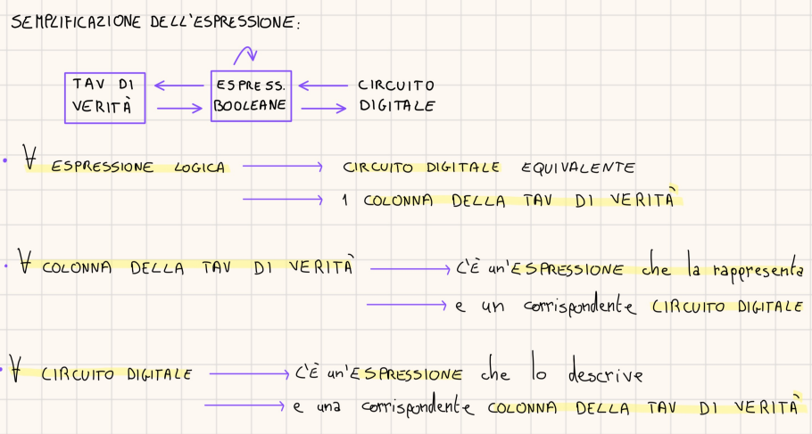

## Da Tavola di Verità a Espressione Logica

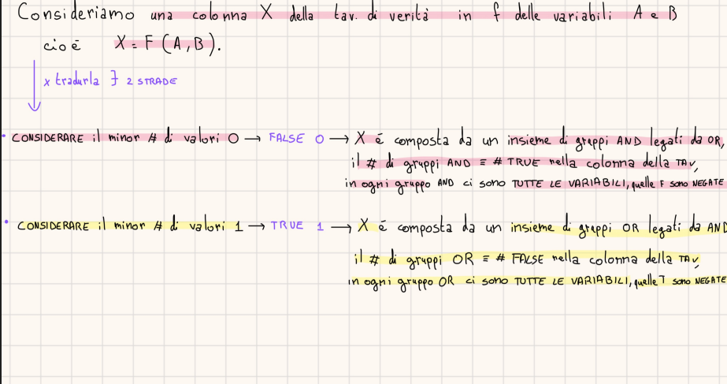

## Gli Operatori Universali

Ogni funzione Logica Booleana si può realizzare con AND,OR e NOT
- AND, OR, NOT si possono realizzare con 1 sola porta: *NAND* o *NOR*

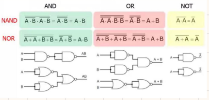

## Circuiti Integrati o Chip

Componenti in *silicio* sui quali sono stampati dei circuiti, in base al # di porte logiche che contengono, possono essere classificati in: 
- **SSI** --> # porte < 10
- **MSI** --> 10 < # porte < 100
- **LSI** --> 100 < # porte < 100.000
- **VLSI** --> # porte > 100.000

# Circuiti Combinatori vs Circuiti Sequenziali

- *Circuiti Combinatori* --> L'output dipende solo dagli input e NON dallo stato del circuito.
- *Circuiti Sequenziali* --> L'output dipende sia dagli INPUT che dallo STATO del circuito.

### Esempi di Circuiti Combinatori

1.  **Multiplexer** : 
- input : $2^n$ bit + $n$ bit di controllo --> selezionano la linea di input da trasferire in output.	
- output : 1 bit.

Un *MUX* può essere utilizzato per realizzare qualsiasi funzione logica.

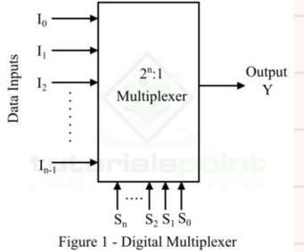

2. **Decoder** : 
- input : numero a $n$ bit.
- output : linea corrispondente al suo valore numerico.

Un *Decoder* è utile per selezionare il chip di memoria corrispondente al valore numerico di un indirizzo.

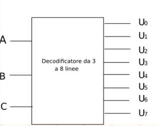

3. **Comparatore** : 
- input : 2 parole a 4 bit.
- output : 1 se le 2 parole (A e B) sono uguali Bit a Bit , cioè $A_i = B_i$ $\forall i \in [0,3]$. Perché viene fatto lo *XOR* Bit a Bit delle parole --> singoli risultati in una *NOR*. 

4. **PLA** (chip generico per implementare circuiti combinatori): 
 - Cuore del Circuito = Array di 50 porte *AND* che creano una matrice $\forall$ linea di ingresso c'è un *fusibile*.

### Circuiti Aritmetici

1. **Shifter** : 
- input : parola.
- output : Shift a Dx o Sx della parola --> a seconda di un segnale Dx = 1 , Sx = 0.

2. **Half Adder** : 
- input : S =  ( a Xor b ) , C = ( a And b ) --> riporto/carry se $\exists$  
Non gestisce il riporto in ingresso. 

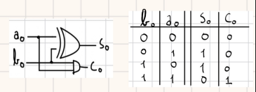

3. **Full Adder** : 
- input : 3 bit  ( a , b , $c_{in}$ ) 
- output : S = a Xor b Xor $C_{in}$ , $C_{out}$  = a And b And $C_{in}$ .
Si costruisce partendo da 2 *Half-Adder*.

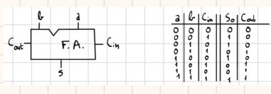

### ALU (Unità Aritmetico Logica)

Una ALU contiene 3 unità: 

- 1  *Decoder*  -->  Per selezionare l'operazione richiesta in base ai segnali $F_0$ e $F_1$.
-  1 *Unità Logica* --> Per calcolare AB, A or B , not B.
- 1 *Full Adder* --> Per calcolare A Xor B Xor $C_{in}$ 

Tramite la tecnica di *Bit-Slice* (suddivisione di bit), è possibile assemblare ALU ad 1 bit per costruire ALU di lunghezza variabile.

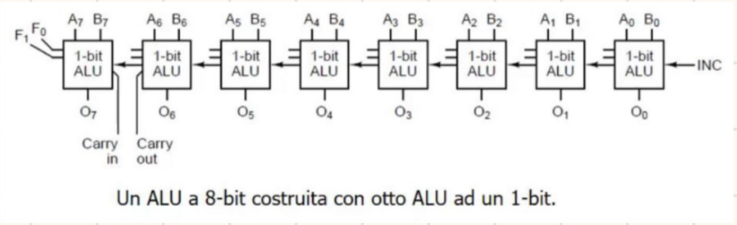

### Clock

Il clock è un circuito che *emette* una *serie di impulsi* di *larghezza predefinita* e ad *intervalli* di *tempo costante*. 

- Ciclo di clock = intervalli di tempo compreso tra 2 fronti in salita di 2 impulsi consecutivi. 
- Per aumentare la risoluzione del segnale di clock --> si può fare un AND tra *segnale originario* e la sua *replica ritardata*.

