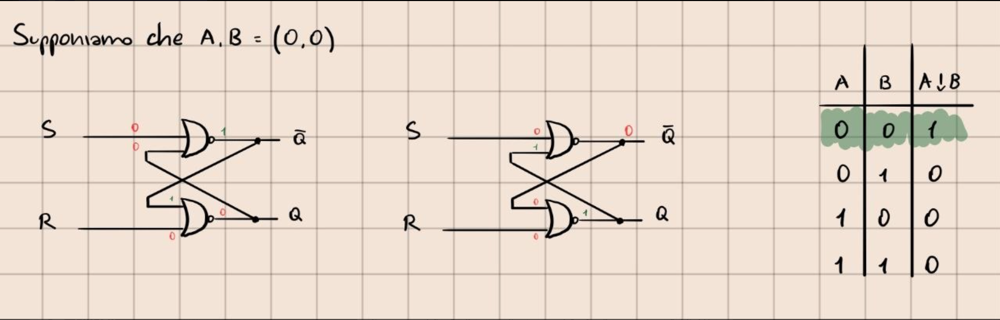
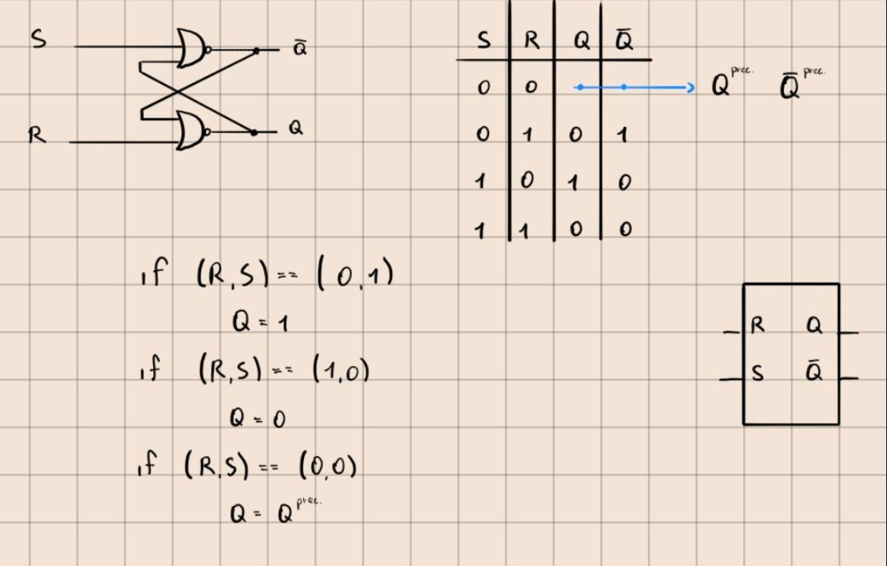
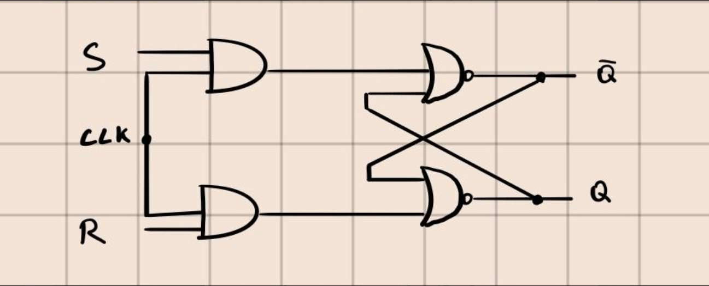
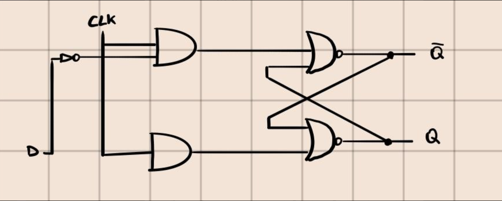
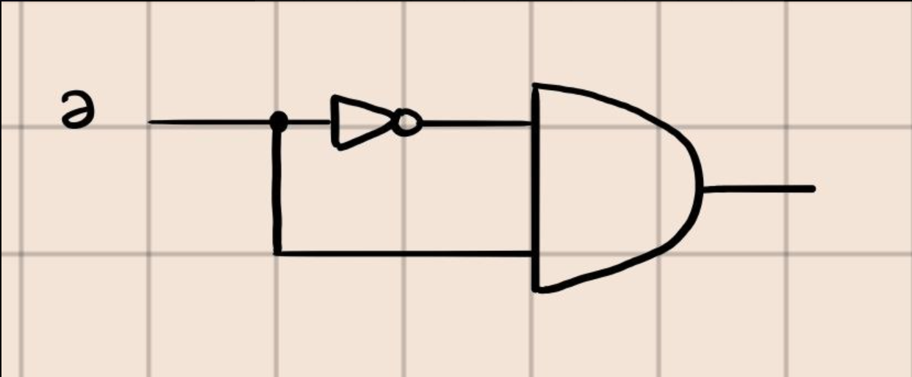
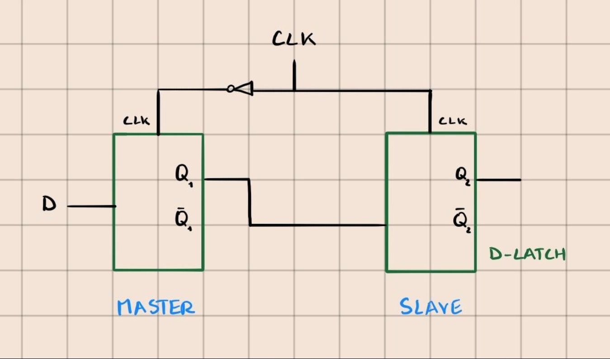
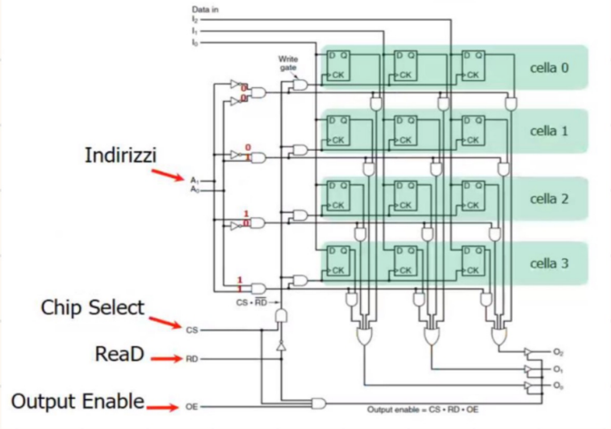

#Architettura 

## Memoria

E' un componente fondamentale per memorizzare DATI e ISTRUZIONI.

Per costruire un circuito che memorizza dati, è necessario utilizzare **CIRCUITI SEQUENZIALI** con Output = Input + Stato Circuito.

---
### Latch 

Il *Latch* è un Circuito Sequenziale realizzabile con 2 NOR oppure 2 NAND: 

---
### SR-Latch

E' un circuito in grado di FISSARE gli 1 bit in output in base ai valori degli input e di MANTENERLI anche quando gli input tornano a 0.

Input: S,R 
Output: Q, not Q

---
### SR-Latch Clocked

Ha un INPUT AGGIUNTIVO = *Clock* --> fa in modo che in passaggi di STATO accadano SOLO in SPECIFICI MOMENTI, quando il clk passa da 0 a 1.

---
### D-Latch Temporizzato

Memoria ad 1 bit il cui valore memorizzato è sempre disponibile sulla linea Q; 
1 solo INPUT = D --> per caricarlo occorre spedire un impulso positivo sul clk.

---

### Generatore di Impulsi

Dispositivo che PRODUCE IMPULSI ELETTRICI per studiare il comportamento dei CIRCUITI STRUTTURA: **AND** + **INVERTER** che ritarda il segnale di uno dei 2 ingressi.

---

### Flip-Flop

Consente di campionare il valore di una certa linea in un particolare ISTANTE e MEMORIZZARLO.
La transizione di STATO si verifica quando il clk passa da 0 ad 1 e VICEVERSA.
Contiene un INVERTER (porta NOT) che modifica il valore di clk.

Da qui otteniamo:
### D-FlipFlop

E' un circuito costituito da 2 **D-Latch** in sequenza collegati ad 1 unico CLOK che:
- Entra negato nel Master.
- Entra asserito nello Slave.

D = Stato Attuale (input)
Q = Stato Futuro (output)

Durante il passaggio del CLK da 0 a 1, il FlipFlop fa passare il valore di D in Q.

---

### Organizzazione della memoria --> Registri

Per un **REGISTRO** ad 1 Byte si possono utiilizzare 8 *D-FlipFlop*.

Per le *memorie di grandi dimensioni*: 

- Si utilizza 1 Indirizzo per Cella, per localizzare.

- Ogni cella contiene lo stesso numero di bit.

- Il circuito usa: 
	- 2 BIT ($A_0$ , $A_1$) per indirizzare le celle.
	- 3 BIT ($I_0$ , $I_1$ , $I_2$ ) per l'ingresso della parola.
	- 3 BIT ($O_0$ , $O_1$ , $O_2$)  per l'uscita della parola.
	- 3 SEGNALI di CONTROLLO: 
		1.  *CS* (CHIP SELECTOR) per selezionare il circuito.
		2.  *RD* (READ) per specificare il tipo di operazione : RD = 1 legge, RD = 0 scrive.
		3.  *OE* (OUTPUT ENABLE) per abilitare le uscite.

La **Dimensione della Memoria** è $2^n * m$  bits con *n* = # linee di indirizzamento , *m* = # bit di informazione per ogni cella.

--- 

### Operazioni di connessione Input / Output

- Collegare più input non crea problemi 
- Collegare più output --> *Rischio Cortocircuito* (anche in scrittura poiché gli ingressi di I/O occupano le stesse linee).

$\Longrightarrow$ Per risolvere il problema esistono 2 soluzioni: 

1.  **Open Collector** : Porta logica che permette di collegare più uscite insieme. 

2. **Buffer Three-State** : Porta logica che si comporta come un' *interruttore*, Abilita (lettura) oppure Disabilita (scrittura) il passaggio del segnale.

 ---

### Chip di Memoria

E' un circuito integrato che contiene milioni di TRANSISTOR e CONDENSATORI.

Hanno schemi riutilizzabili e facilmente espandibili. 
Per la *LEGGE di MOORE* "il # di bit che si può INSERIRE in 1 CHIP raddoppia all'incirca ogni 18 mesi".

Esistono 2 tipi di segnali: 
1. Logica Positiva --> Attivi quando sono ad Alto livello. 
2. Logica Negativa --> Attivi quando sono a Basso livello.

Un computer ha MOLTI CHIP  --> Bisogna definire *Segnali Fondamentali*.

- *CS* (CHIP SELECTOR) per selezionare il chip da attivare.
- *WE* (WRITE ENABLE) per determinare il tipo di operazione di accesso alla Memoria.
- *OE* (OUTPUT ENABLE) per fondere insieme gli output.

---

## RAM statica e dinamica 

Le *RAM* (Random Access Memories) sono memorie volatili che hanno lo stesso tempo di accesso.

Esistono 2 tipi di RAM: 

1. **SRAM**  (Static RAM) -> Vengono costruite con circuiti simili ai *D-FlipFlop*, mantengono le informazioni finché sono alimentate.
   Sono molto veloci, vengono utilizzate per la *CACHE*.

2. **DRAM** (Dynamic RAM) -> Non utilizzano Flip-Flop ma un *ARRAY* di celle con un transistor e un condensatore, sono più complesse delle SRAM a livello hardware.

---

## Chip di Memoria NON Volatile

Esistono vari tipi di memorie non volatili:

1. **ROM**  (Read Only Memory) -> Sono memorie a *SOLA LETTURA*, il contenuto NON CAMBIA quando non c'è corrente.

2. **PROM**  (Programmable Rom) -> Rom programmabile una sola volta bruciando dei fusibili al suo interno.
   
3. **EPROM** (Erasable ROM) -> Prom riprogrammabile attraverso l'esposizione di raggi ultravioletti per 15 minuti. 
   
4.  **EEPROM** (Electrically Erasable ROM) -> EPROM riprogrammabile attraverso un impulso elettrico, vengono utilizzate per la *MEMORIA FLASH*.

---

## Chip della CPU 

Le CPU moderne sono contenute in 1 CHIP dotato di  **PIN**  con cui la CPU comunica con l'esterno.  

I *Pin* sono connessi agli altri componenti tramite il **BUS**. 
Inoltre sono divisi in 3 categorie:
-  **Indirizzo**.
-  **Dati**.
-  **Controllo**.

Il processo di esecuzione di un'istruzione dalla CPU:

 1.  Pone l'indirizzo di memoria sul *Bus Indirizzi*.
    
 2. La CPU informa la MEMORIA che vuole eseguire un'operazione di lettura tramite le linee di controllo.
    
 3. La MEMORIA risponde mettendo la parola sul *Bus Dati* e Asserisce un Segnale per avvisare che l'operazione è stata svolta.
    
 4. La CPU riceve il segnale, legge i DATI e si predispone per l'ESECUZIONE.

---

### Pin della CPU 

Le prestazioni di una CPU dipendono dal # di *PIN* per **INDIRIZZAMENTO** e **DATI**.

I *PIN* di **CONTROLLO** possono essere raggruppati in: 
- Interruzioni
- Arbitraggio Bus
- Controllo Bus
- Comunicazione con CoProcessore
- Stato 
- Altro

---
 
## Bus del Calcolatore

E' un collegamento elettrico COMUNE che unisce i vari dispositivi di un calcolatore.

Può essere **INTERNO** oppure **ESTERNO** alla CPU.

- **Interno** -> connette i registri alla ALU (lezione 2).
- **Esterno** -> connette la MEMORIA alle periferiche di I/O.

### Configurazione dei Bus Esterni

Alcuni dispositivi sono detti **ATTIVI** (MASTER) $\Rightarrow$ Possono iniziare il TRASFERIMENTO DATI sul Bus, altri sono detti **PASSIVI** (SLAVE) $\Rightarrow$ rimangono in attesa di richieste dal MASTER.

I **BUS DATI** sono dotati di CHIP di INTERFACCIAMENTO e per evitare il problema di connettere più uscite insieme vengono utilizzate porte logiche come *Buffer Three-State* oppure il collegamento di più porte *Open Collector*.

Oltretutto esistono: 
- Bus **DRIVER** -> amplifica il segnale da Master a Slave.
- Bus **RECEIVER** -> collega più Slave ai Master.

### Differenza tra Ampiezza e Larghezza di Banda nei Bus

**Ampiezza del Bus** --> E' la capacità fisica del bus, descrive il # di bit dati trasferibili in 1 ciclo di clock e il # di linee fisiche che compongono il bus dati.
Se un Bus ha *n* linee di ADDRESS $\Rightarrow$ la CPU può indirizzare almeno $2^n$ locazioni di memoria.

**Larghezza di Banda** --> E' la velocità di trasferimento effettiva, indichiamo con u = MB/s, è la quantità massima di dati trasferibili nell'u di tempo.
Per incrementare la larghezza di banda possiamo: 
1.  Ridurre il periodo di CLK del Bus: 
	-  Pro: Bus più veloci.
	- Contro: 
		- *Disallineamento bus* --> segnali su linee diverse hanno velocità diverse.
		- *Perdita di retrocompatibilità* --> le schede progettate per bus più lenti non funzionano su quelle più veloci.
		- 
2.  Incrementare l'ampiezza del bus DATI:
	 Utilizzando il MULTIPLEXING delle linee per DATI e INDIRIZZI, rallentando il sistema.

### Temporizzazione del Bus

Esistono 2 approcci: 

-  **BUS SINCRONI** --> Utilizzano un clock che determina la temporizzazione delle attività sul bus (ciclo di clock): ogni operazione richiede un numero di periodi di clock per essere eseguita.

Operazioni: 

  1.  La CPU (Master) pone l' indirizzo di memoria sull' *address bus*.
  2. La CPU comunica al SISTEMA che vuole svolgere un'operazione con la MEMORIA.
  3. La CPU comunica che si tratta di un'operazione di LETTURA, allora la MEMORIA (Slave) deve fornire sul *data bus* il contenuto della cella indirizzata dall'*address bus*.
  4. La Memoria chiede un WAIT-STATE (memoria + lenta della CPU).
  5. Quando la Memoria è pronta, nega il segnale di WAIT, così la CPU può leggere.
  6. La CPU legge i dati.

- **BUS ASINCRONI** --> Non c'è un CLOCK principale, il ciclo può avere qualsiasi durata (+efficiente ma + difficile da eseguire).

Operazioni:

1. Con MSYN la CPU (Master) richiede l'inizio di un'operazione.
2. Con SSYN la MEMORIA (Slave) avvisa che i dati sono disponibili.
3. Il Master NEGA MSYN.
4. Lo Slave nega SSYN.
   

### Arbitraggio del Bus

Ogni dispositivo può diventare a turno MASTER del Bus.
--> L'arbitraggio del Bus impedisce che più dispositivi possano diventare Master contemporaneamente.

Esistono 2 tipi di Arbitraggio del bus: 

-  **Arbitraggio Centralizzato** --> Attraverso un ARBITRO, quando esso riceve una richiesta la concede: Asserendo una linea di *CONCESSIONE del Bus*. 
   Quando il dispositivo più vicino vede la concessione: 
	- Se la richiesta è stata inoltrata da lui, ogni altra linea viene negata.
	- Altrimenti mantiene la linea asserita.
	
	Nel caso uno o più dispositivi facessero richiesta, *vince il più vicino all'arbitro*: PRIORITA' CABLATA.
	Contrapposta all' Arbitraggio con più Linee di Priorità, in cui sono definiti dei livelli di priorità utilizzando diverse linee Richiesta-Concessione. L'arbitro concede la richiesta al disp. con *PRIORITA' più ALTA*.

- **Arbitraggio Decentralizzato** --> Ogni dispositivo ha una *propria linea di richiesta* e di *priorità* .
	-   Prima di richiedere il bus, ciascuno deve verificare che NON CI SIA una richiesta con PRIORITA' più ALTA.
	- Al termine dell'utilizzo del bus, la linea di richiesta deve essere negata.
	Lo svantaggio è di avere troppi collegamenti e linee.
	
	Uno **SCHEMA ALTERNATIVO** è caratterizzato da 3 linee: 
	
	1. Linea RICHIESTA del Bus.
	2. Linea BUSY.
	3. Linea Arbitraggio.
	Per ottenere un Bus, un dispositivo deve: 
	
	1.	 
		- Verificare che BUSY sia negata.
		- Verificare che IN sia asserito.
	1. 
		- Negare OUT.
		- Asserire BUSY.
		- Diventa MASTER.
	2. 
		- Asserire OUT.
		- Negare BUSY.

### Interrupt Handling

Esiste un CICLO di BUS dedicato alla **gestione degli INTERRUPT**.

La CPU ordina ad un Disp. di effettuare un'operazione, che viene terminata tramite un Bus che invia un *segnale di INTERRUPT*.

Il PROBLEMA che si pone è che più dispositivi richiedano di generare un *interrupt* contemporaneamente.
La SOLUZIONE prevede di assegnare PRIORITA' ai disp. mediante ARBITRO CENTRALIZZATO.

- Quando più dispositivi richiedono *INTERRUPT*, il controllore ASSERISCE il segnale INT alla CPU. 
- Se la CPU può gestire la richiesta, RISPONDE con il segnale INTA.
- Il CONTROLLORE pone sul Data BUS il # del Dispositivo richiedente l'INTERRUPT.
- La CPU utilizza il numero (#) per accedere al VETTORE DI INTERRUZIONE e trovare l'indirizzo della ISR.

