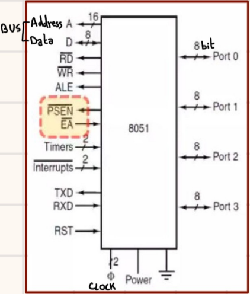
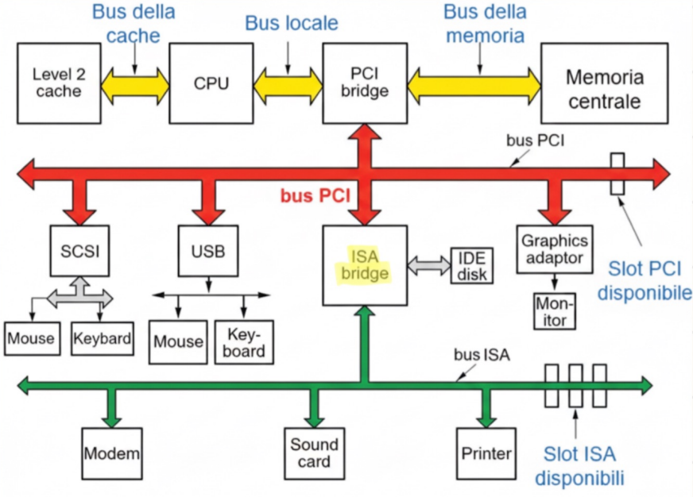

#Architettura 

## Esempi di CPU

### INTEL CORE i7

E' una CPU con 4 processori, a 64 bit dove ogni *CORE* è **HYPERTHREADED** (più thread attivi in linea sullo stesso CORE) ed ha 3 livelli di *CACHE*.

---

### PENTIUM 4

E' un processore che può scambiare dati con la MEMORIA a 64 bit, ma dal pov Software è a 32 bit.

Possiede 2 BUS SINCRONI Primari:
1. **Primary BUS** -> utilizzato per accedere alla memoria principale.
2. **BUS PCI** -> utilizzato per i dispositivi di I/O.

Ha una **Microarchitettura INTERNA** NETBURST che prevede: 

- Pipeline più profonda.
- 2 ALU.
- HYPERTHREADING.
- 2 insiemi di REGISTRI.
- 2/3 livelli di *cache*.

Ha **478** PIN: 
- Segnali Principali di risposta: 
	- RS# --> contiene il codice di stato.
	- TRDY# --> indica che lo SLAVE è pronto.
	- BNR# --> stato di attesa.
- Alimentazione
- Massa
- Liberi

Sono previsti *5 livelli* di FUNZIONAMENTO per la CPU:
da **Stato Attivo** a **Sonno Profondo** (solo un Segnale Hardware può risvegliarlo) --> negli ultimi stati intermedi, alcune funzionalità sono disattivate.

---
### Ultrasparc III

CPU *RISC* (esegue poche istruzioni semplici, eseguibili rapidamente) a 64 bit.
La CPU poteva eseguire 4 ISTRUZIONI per ciclo di clock e aveva 6 pipeline interne.

- da 2 a 14 STADI per operazioni su interi.
- 2 per operazioni in virgola mobile.
- 1 per operazioni in memoria.
- 1 per salti e branch.

*GESTIONE DELLA CACHE* :
2 CACHE L1 per ISTRUZIONI e DATI.
2 CACHE L2 per PREFETCH  e collezione SCRITTURE.
Controller CACHE interno al chip.

---

### Microcontrollore 8051

Uno dei più diffusi tra i Microcontrollori per via del suo *basso costo*.
Prevede 40 Pin: 16 bit di ADDRESS e 8 bit per il Bus DATI e 32 linee di I/O divise in 4 gruppi.

- **EA** -> (External Access):  Low (utilizza memoria interna + esterna) o High (utilizza memoria esterna).
- **A** -> Bus indirizzi per la memoria esterna.
- **RD** -> Per leggere.
- **WR** -> Per scrivere.
- **ALE** -> Per indicare la presenza di un indirizzo valido.
- **TXD** -> Per output.
- **RXD** -> Per input.
- **RST** -> Per reset del chip.

---

## Esempi di BUS

### Bus ISA 

E' il BUS del primo PC IBM, ad *8 bit* con un clock di 8,33 MHz.

### Bus EISA

EISA (Extended ISA) è il successore del bus ISA, a *32 bit* con banda più larga

Sia ISA che EISA avevano una Velocità Insufficiente per i contenuti multimediali.

---
### Bus PCI

Esegue l'interconnessione dei componenti periferici, con un clock di 66 MHz.
Utilizza l' ARBITRAGGIO CENTRALIZZATO con l'arbitro contenuto in uno dei CHIP di BRIDGE.
L'arbitro è connesso agli altri dispositivi tramite 2 linee: 
- REQ# -> per richiedere il Bus.
- GNT# -> per confermare la richiesta.

Architettura Hardware (non moderna) tipica di un pc -> Bus diversi per velocità diverse, l' ISA BRIDGE conteneva l'interprete.

### Bus PCIE

Il Bus PCIE (PCI Express) è una rete punto a punto con *Linee Seriali* tra le periferiche e una *Connessione*, di tipo Master-Slave, dedicata per ogni chip di I/O = **SWITCH**.

Master-Slave : Il *Master* invia un pacchetto che contiene: info di controllo, dati da trasferire, codice di correzione, allo *Slave*.

Si tratta di un'architettura ESPANDIBILE tramite il collegamento ad un altro switch.
Sono più piccoli perché i connettori seriali occupano meno spazio.

### USB 

L' USB (Universal Serial Bus) è un bus standard per dispositivi a bassa velocità poiché PCI e PCIE sono troppo costosi.

---

## Interfacce I/O

Schede che permettono ai dispositivi di I/O di collegarsi sul bus e scambiare dati nel computer.

Esistono dei CHIP STANDARD: 
- **UART** -> Trasmette 1 bit alla volta da *Bus* a *Linea Seriale* o viceversa.
- **USART** -> UART con la possibilità di *Trasmissioni Sincrone*.
- **PIO** -> Supportano la *Comunicazione Parallela*, più bit contemporaneamente su linee separate.

### TIpi di indirizzamento dell' I/O

1. **Port - Mapped** -> Necessita di una LINEA del CONTROL BUS per distinguere dove eseguire l'operazione: in Memoria o sull' I/O.
2. **Memory - Mapped**  -> E' necessario riservare uno spazio in Memoria destinato all'I/O.