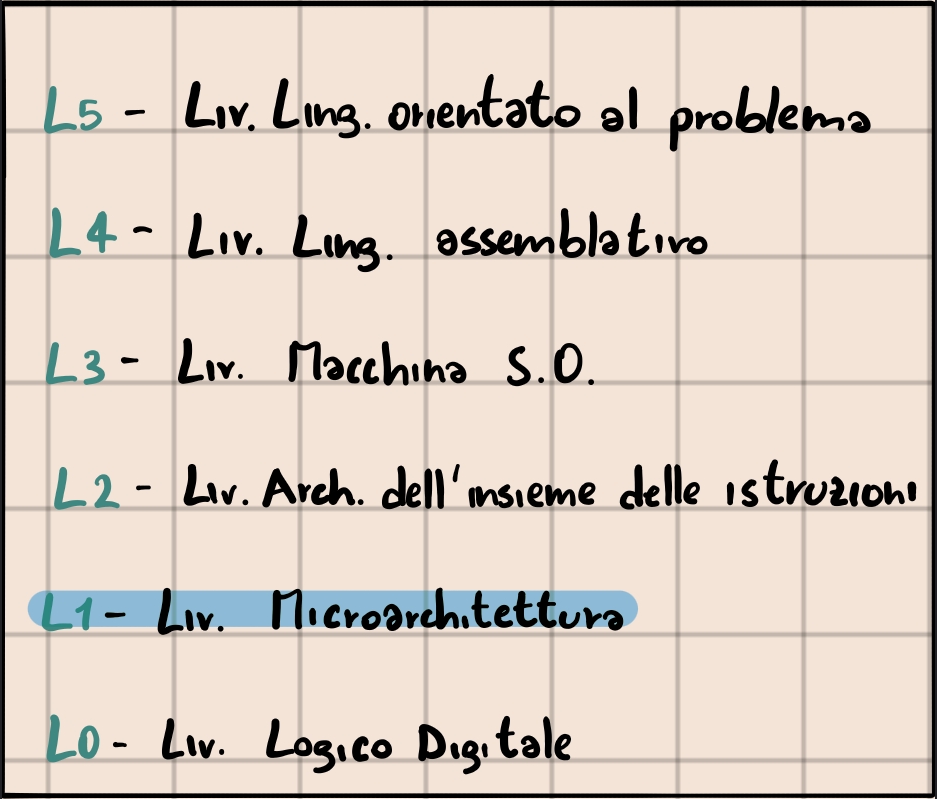
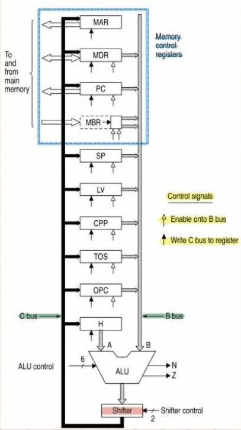
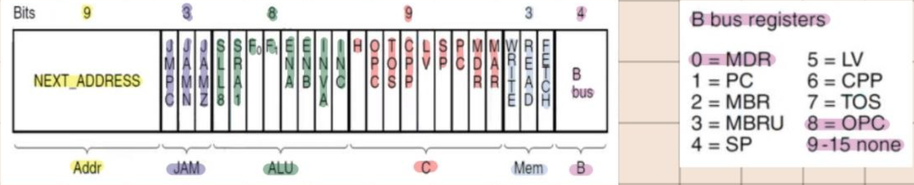
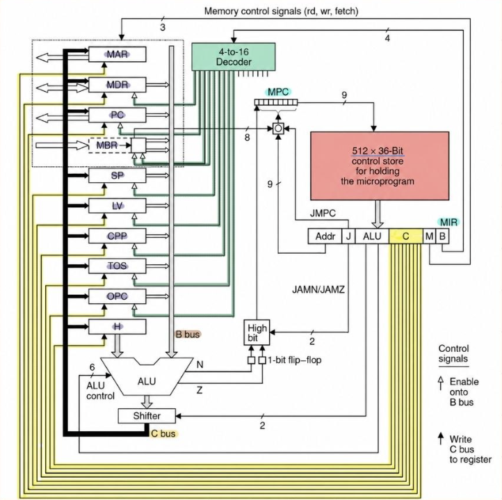

#Architettura 

## Microarchitettura 

Quando parliamo di Microarchitettura, ci troviamo al *Livello 1* 

Un esempio:
**Microprogramma** contiene una sequenza di *Microistruzioni*:
- Composte da variabili che Descrivono lo stato della macchina.
  
Ciascuna contiene:
- *Codice Operativo* (OpCode) -> Identifica il tipo di istruzione.
- *Operando* -> Su cui applicare l'istruzione.

### Modello di esecuzione delle istruzioni:

-> **Fetch** (Caricamento in memoria) -> **Decode** (Riconoscimento del Tipo di istruzione) -> **Execute** (Esecuzione) -> Fetch ..... 

### Datapath

Il DATAPATH è la parte della CPU che contiene: ALU, Registri Interni,  I/O.

- I Registri MAR, MDR, PC, MBR controllano l'accesso in Memoria.
- Sono presenti 2 Bus : C, B.
- Alla base della ALU c'è lo Shifter.
- Ci sono due segnali di controllo: 
	- Freccia Nera: serve per abilitare la scrittura dal Registro al Bus B.
	- Freccia Bianca: serve per scrivere il contenuto del Bus C sul Registro.

ELENCO DEI REGISTRI :

- MAR -> Memory Address Register.
- MDR -> Memory Data Register.
- PC -> Program Counter.
- MBR -> Memory Byte Register.
- SP -> Stack Pointer.
- LV -> Local Variable.
- CPP -> Constant Pool.
- TOS -> Top word On the Stack.
- OPC -> Op Code Register.
- H -> Holding.

ALU :

La ALU (Arithmetic Logic Unit) possiede 6 linee di controllo:
- F0 e F1 per selezionare il tipo di funzione.
- Enx per abilita/annulla il valore della variabile x.
- INVA inverte la variabile A, utile per la sottrazione.
- INC incrementa.

Agisce su 2 operandi: 1 dal registro H, 1 dal Bus B.

L'operando B si può spostare in A: 
--> chiamando la funzione che restituisce B e memorizzando il risultato del Bus C in H.

Lo SHIFTER può far scorrere i bit/byte del risultato verso DX/SX.

INCREMENTARE UN REGISTRO IN 1 CICLO DI CLOCK :

**Fase 1** : Prendere il valore del Registro sul Bus B.
**Fase 2** : Disattivare A e Incrementare B.
**Fase 3**:  Ignorare lo scorrimento dello shifter.
**Fase 4** : Scrivere il risultato nel registro originario.

### Formato delle microistruzioni (36 bit)

Si compone di: 

- ADDR -> Indirizzo della successiva microistruzione, 9 bit.
- JAM -> Determina come selezionare la prossima microistruzione, 3 bit.
- ALU -> Seleziona le funzioni dell' ALU o dello SHIFTER, 8 bit.
- C -> Seleziona quali REGISTRI sono scritti dal Bus C, 9 bit.
- MEM -> Seleziona la funzione in Memoria, 3 bit.
- B -> Seleziona quale REGISTRO è scritto sul Bus B, 4 bit.

### Microarchitettura Mic-1

Il **Mic-1** si compone di: 

- **Decoder 4:16** -> Per decodificare il tipo di istruzione in base all' OpCode.
- **Memoria  di Controllo** 512 * 36 bit -> Per memorizzare le microistruzioni e contenere il microprogramma, ha 2 registri specifici: MPC per gli indirizzi e MIR per i dati.
- **Registri del Datapath** -> 

FUNZIONAMENTO DEL MIC-1 

Bisogna sincronizzare le operazioni in 1 ciclo di clock, che è diviso in *4 intervalli di tempo* con ognuno un compito specifico.

1.  $\Delta W$ -> FRONTE DI DISCESA: fase inziale in cui la Microistruzione dal MPC viene caricata nel MIR.
2. $\Delta X$ -> I registri caricano i loro dati sul Bus e questi iniziano ad andare verso l' ALU.
3.  $\Delta Y$ -> La ALU esegue l'operazione e lo SHIFTER fa eventuali spostamenti.
4. $\Delta Z$ -> Il RISULTATO viene propagato tra i registri.

Una volta finito il Primo Ciclo di Clock, c'è il FRONTE DI SALITA (altro ciclo di clock) in cui:
- I risultati sono caricati nei registri e nella memoria.
- L'indirizzo della Microistruzione successiva viene caricato nel MPC.

