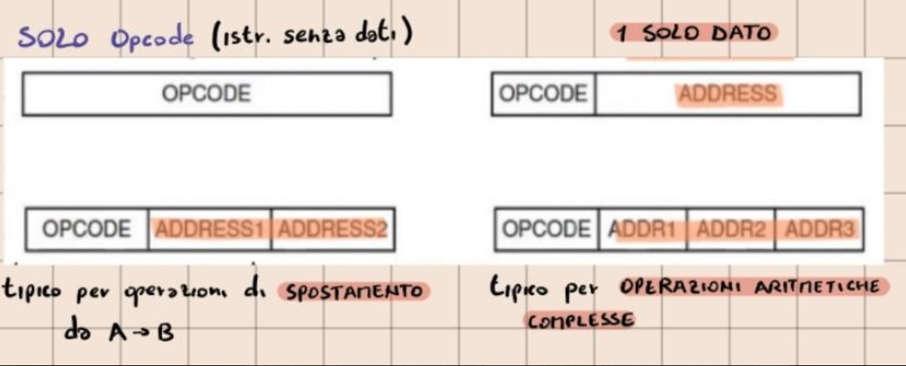

#Architettura 

## Microarchitettura Livello ISA

Il livello ISA è l'insieme delle microistruzioni.
E' un'interfaccia ASTRATTA tra HARDWARE e SOFTWARE, l'ISA si compone di:

- Modello di Memoria.
- Insieme dei Registri.
- Insieme delle Istruzioni.
- Tipi di Dati possibili.

Dall' ISA non si può riconoscere la MICROARCHITETTURA, e deve essere retrocompatibile.
Ha 2 modalità operative: 
- Kernel: Per eseguire il S.O. e tutte le istruzioni. 
- User: Per eseguire i programmi utente.

### Modelli di memoria

In tutti i computer la MEMORIA è divisa in CELLE da 1 byte, organizzate in GRUPPI di 4 o 8 PAROLE.  

Tali parole possono essere: 
- **Allineate all'indirizzo di base**: Per esempio se una parola di 8 byte inizia esattamente all'indirizzo 8, il processore può leggere TUTTI i DATI in 1 operazione. In questo modo si massimizza l'efficienza.
- **NON ALLINEATE all'indirizzo base**: Per esempio se una parola di 8 byte inizia all'indirizzo 12, significa che la parola è spezzata esattamente a metà tra 2 righe e il processore dovrà eseguire 2 operazion per leggerla. Questi rallenta le prestazioni causando errori.
  

### Registri ISA

Tutti i computer hanno registri visibili a Livello ISA, ma alcuni registri dei livelli sottostanti non lo sono.

I registri ISA possono essere divisi in 2 categorie: 
1. SPECIALIZZATI : PC, SP, e quelli visibili in modalità kernel.
2. DI USO GENERALE : Per memorizzare Risultati Temporanei delle variabili locali.

Il *registro dei Flag* è un ibrido tra modalità Kernel e Utente, i tipi di flag sono :

-  **N** -> Asserito se il risultato è negativo.
- **Z** -> Asserito se il risultato è = 0.
- **V** -> Asserito se il risultato causa Overflow.
- **C** -> Asserito se il risultato causa Carry.
- **A** -> Asserito se c'è CARRY oltre il terzo bit.
- **P** -> Asserito se il risultato è PARI.

### Tipi di dato

Sono raggruppabili in: 

- **NUMERICI** : 
	1. Interi -> Senza segno o Con Segno (rappresentabili in 2 modi: Bit di segno o Complemento alla base).
	2. Reali -> Per cui si usa la notazione scientifica: N = mantissa * $10^n$.
	3. Booleani -> Rappresentabili con 0/1.

- **NON NUMERICI** :
	1. Caratteri -> Ascii e Unicode.
	2. Bit Map.
	3. Puntatori.

### Formati di istruzioni

Un'istruzione è composta da:
- Opcode = Codice Operativo
- Indirizzo di riferimento degli operandi.
  
  Esempi di formati: 

CRITERI PROGETTUALI :

- Istruzioni Corte: Programmi più piccoli, si possono memorizzare più info nella Cache dei processori. 
- Istruzioni Non troppo Corte: Problemi di DECODIFICA.

 L'ideale è Prevedere lo spazio sufficiente per esprimere tutte le operazioni desiderate in base al sistema di codifica e il numero di Bit per l'indirizzamento.