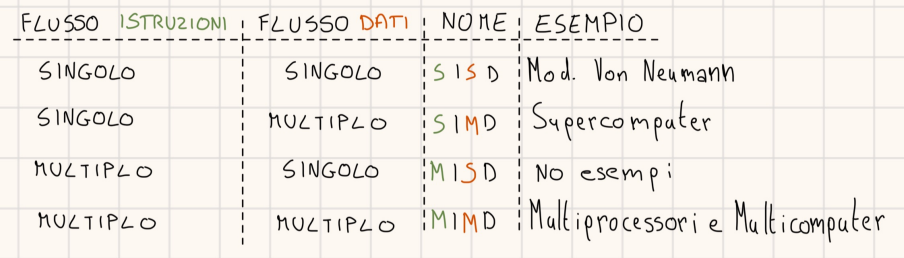
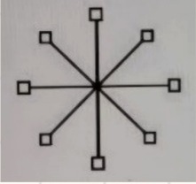
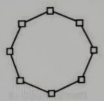
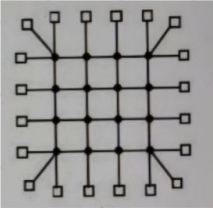
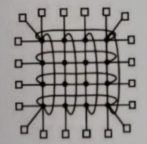
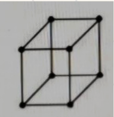
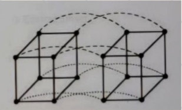

#Architettura 

## Architetture Parallele

Per incrementare drasticamente le Performance occorre progettare Sistemi con molte CPU.

La **classificazione di Flynn**: 

E' utile ricordare i 2 tipi di Parallelismo:
- Livello delle ISTRUZIONI -> Più istruzioni in 1 ciclo di clock.
- Livello della CPU -> Più CPU collaborano per lo stesso compito.

### MultiThreading nel Chip

Quando parliamo di multithreading in un chip intendiamo la possibilità di passare da un THREAD ad un altro per evitare le Attese dovuto al tentativo di accesso in Memoria.

Tipi di Multithreading:

- A Grana FIne -> Le singole istruzioni dei thread sono eseguite ad ogni ciclo di clock, nei cicli di STALLO la CPU è occupata con altri thread.
- A Grana Grossa ->Un thread va avanti fino allo STALLO.
- Simultaneo -> Ogni thread ha 2 istruzioni per Ciclo fino allo STALLO.

### Multiprocessori

Il calcolatore, contiene più CPU (dette CORE) nello stesso chip, che condividono la Memoria principale.

TIPI di Multiprocessori : 

1. **UMA** (Uniform Memory Access) -> Può essere di diversi tipi:

   - Con SINGOLO BUS: Funziona bene con poche CPU.
     
   - Con SINGOLO BUS e CACHE nella CPU: Riduce il traffico sulla bus.
     
   - Con SINGOLO BUS e CPU dotate di RAM: Separazione tra le variabili locali (RAM) e globali (BUS).
     
   - Con CROSBAR SWITCH: Rete di INTERCONNESSIONE che collega "N" CPU a "K" Memorie.
   
   - Con Rete di COMMUTAZIONE MULTILIVELLO:  Scambio di messagi che contengono (MODULO, INDIRIZZO,OPCODE,VALORE). 
     
     Un esempio è la RETE OMEGA: Ha uno schema *PERFECT SHUFFLE*, collega ad "N" CPU, "N" MEMORIE, è una *RETE BLOCCANTE* -> non tutte le richieste possono essere processate contemporaneamente. I riferimenti in Memoria vanno distribuiti rispetto ai moduli.
     
2. **NUMA** (Non Uniform Memory Access) -> Prevede uno spazio di indirizzamento unico rendendo lento l'accesso alla memoria remota. 
   
   Sono presenti due tipi di *NUMA*:
   
	- NO CACHE NUMA: il ritardo di accesso alla memoria vuota non è mascherato.
	- CACHE NUMA: C'è un sistema di CACHE COERENTI, con un database si tiene traccia di ogni linea di cache, per mascherare il ritardo di accesso.
	  
3. **Modello MASTER-SLAVE**:  
   - Una sola CPU (*MASTER*) gestisce il S.O. e le chiamate, le altre CPU (*SLAVE*) eseguono solo i processi utente.
     
4. **Multiprocessori SIMMETRICI** -> Tutte le CPU condividono una copia del S.O. e possono gestire le chiamate.

### Multicomputer

In un multicomputer, tutte le CPU sono interconnesse, ognuna con la sua memoria.

La comunicazione tra PROCESSI avviene tramite lo SCAMBIO di MESSAGGI attraverso la RETE di INTERCONNESSIONE.

Ogni CPU riconosce la CPU che ha inviato la richiesta e fornisce una copia dei dati richiesti 
-> SEND & RECEIVE.

L'invio dei messaggi può essere:
- Blocking -> La CPU si BLOCCA fino alla fine della trasmissione.
- Non Blocking -> La CPU prosegue le sue operazioni.
  
L' HARDWARE dei MULTICOMPUTER:

La TOPOLOGIA di una RETE è il modo in cui sono disposti i COLLEGAMENTI e i COMMUTATORI:
Le topologie di multicomputer sono le seguenti:

- **STELLA** -> Tutti i nodi sono Connessi ad 1 Switch Centrale che gestisce tutte le comunicazioni, questa topologia è vulnerabile ai guasti.

  
- **ANELLO** -> Ogni nodo è collegato al PRECEDENTE e al SUCCESSIVO, è economico ma ha prestazioni Limitate per la potenziale congestione del traffico.

- **MAGLIA** -> E' una griglia Bidimensionale dove OGNI NODO è collegato direttamente ad altri nodi, è una topologia costosa da implementare e da gestire. Ha uno schema altamente scalabile e una buona tolleranza ai guasti.

- **DOPPIO TORO** -> E' la versione migliorata della MAGLIA con collegamenti tra i Nodi ai Bordi, prevede una Latenza ridotta e una migliore tolleranza ai guasti.

- **CUBO TRIDIMENSIONALE** -> E' un'estensione della MAGLIA in 3 dimensioni.

- **IPERCUBO** -> E' un'estensione della MAGLIA in più di 3 dimensioni, è ottimo per ridurre la latenza ma è molto costoso.

### Virtualizzazione

La virtualizzazione è una tecnica che consente di ESEGUIRE più sistemi operativi (Guest SO) su una macchina fissa simulando più ambienti isolati (Virtual Machine) con RISORSE PROPRIE.

I principali vantaggi della virtualizzazione sono: 

- Ottimizzazione Hardware -> Più sistemi su una macchina.
- Isolamento -> Un guasto su una VM non compromette le altre.
- Flessibilità -> Facile creazione, Copia e Backup per le VM.
- Sicurezza: Per via dell' *isolamento*.
- Risparmio: Sia economico che energetico, si ha meno hardware da acquistare/raffreddare/alimentare.
  

### Hypervisor

L'hypervisor è il SOFTWARE che gestisce le operazioni kernel.

Tipologie di hypervisor:

- Hypervisor di tipo 1 -> Lavora direttamente sull'hardware senza S.O. intermedio, è un S.O. che ha come unico scopo AVVIARE e GESTIRE le VM.
  Ha prestazioni elevate e un consumo molto basso.
  
- Hypervisor di tipo 2 -> E' un applicazione software che gira su un S.O. già esistente, è più semplice da installare ma ha prestazioni inferiori e consumo più alto.
  
  
  