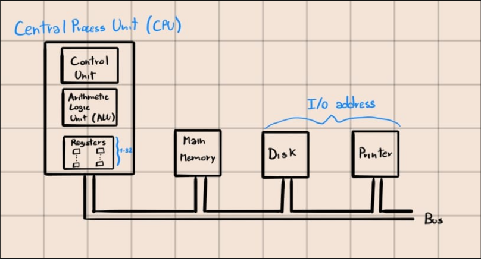
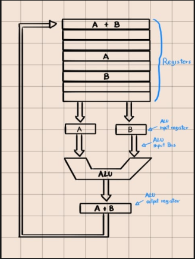
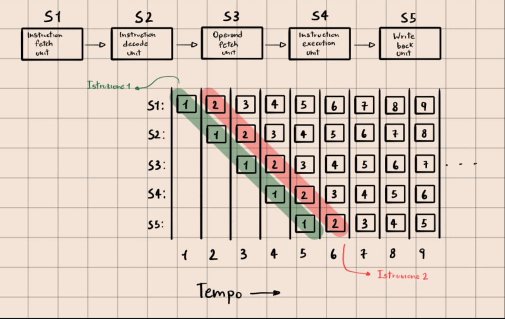
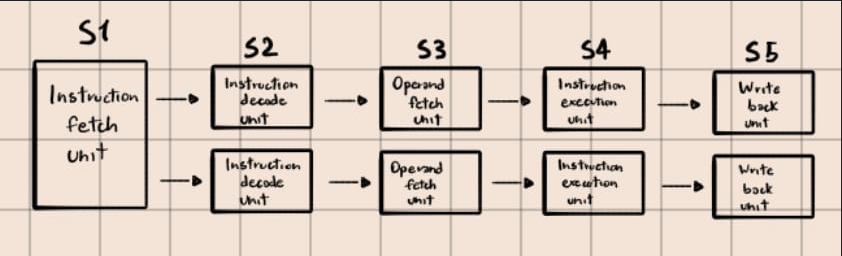
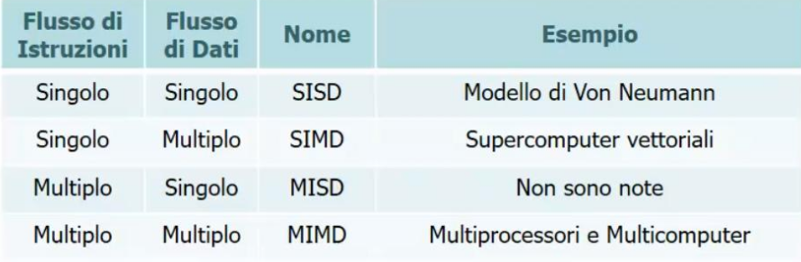
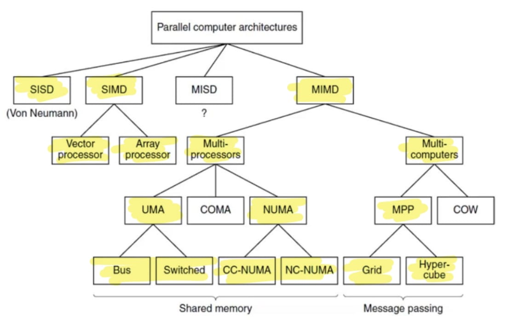
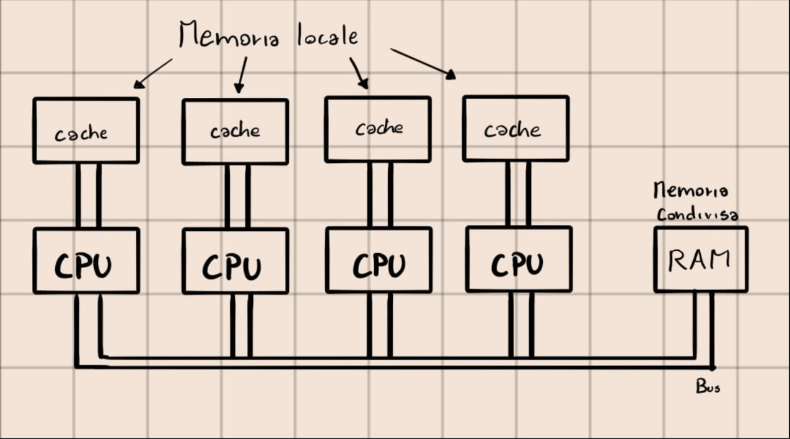
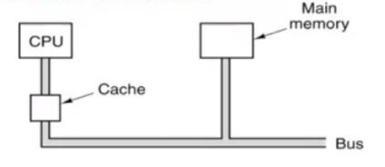
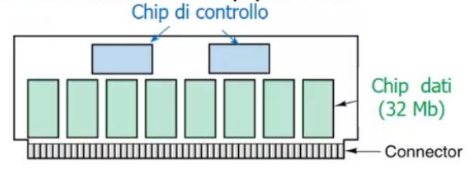
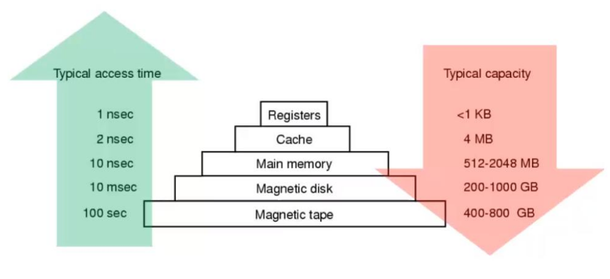

#architettura
# Processori

Il cervello del computer è la *CPU* (Central Process Unit), composta da:
- *CU* (Control Unit) 
- *ALU* (Arithmetic Logic Unit) 
- *Registri*, piccole memorie ad altissima velocità, composte da: 
	- *PC* (Program Counter), punta alla prossima istruzione da prelevare per l'esecuzione.
	- *IR* (Instruction Register), mantiene l'istruzione corrente in fase di esecuzione.

Le componenti di un computer sono collegate attraverso un *bus*: una collezione di cavi paralleli utilizzati per trasferire indirizzi, dati e segnali di controllo.

## Organizzazione della CPU 

Una tipica CPU di Von Neumann contiene il *Datapath* costituito da:
- *Registri* (da 1 a 32)
- *Alu*, esegue operazioni su registri di input (A,B) del tipo: addizioni, sottrazioni e altre operazioni come  Registro-Memoria  (è necessaria una fase di caricamento delle parole dalla memoria nei registri) e Memoria-Memoria (gli operandi sono già pronti nei registri). Il registro è posto nel registro di uscita che può essere memorizzato nei registri e successivamente nella memoria.
- Vari bus di collegamento

## Esecuzione delle istruzioni

Il *fetch-decode-execute* è fondamentale per l'esecuzione delle istruzioni nel computer, ha i seguenti passaggi: 

1. Preleva l'istruzione successiva dalla memoria (tramite il PC) e la inserisce nell' IR.
2. Aggiorna il program counter in modo che punti alla prossima istruzione. 
3. La CU decodifica l'istruzione in IR. 
4. Se l'istruzione referenzia una parola in memoria, la ricerca.
5. Se necessario preleva la parola dalla memoria e la inserisce in un registro.
6. Esegue l'istruzione.
7. Riparti dal punto 1. per eseguire la prossima istruzione.

## Strategie di progettazione delle CPU

Architettura della CPU: 
- Cisc (Complex Instruction Set Computer) -> La CPU è in grado di comprendere molte istruzioni complesse nativamente.
- Risc (Reduced Instruction Set Computer) -> La CPU esegue poche istruzioni semplici, eseguibili rapidamente.
- Approccio Ibrido -> A partire dal x486, la CPU Intel contengono un sottoinsieme di istruzioni RISC eseguibili in un singolo datapath e altre più complesse interpretate attraverso la CISC. 

## Principi di progettazione dei calcolatori

I progettisti di CPU tentano di seguire un insieme di principi denominati principi di progettazione RISC :

- Tutte le istruzioni devono essere eseguite direttamente dall'hardware:
	-   Le istruzioni non vanno interpretate. Per le architetture CISC, le istruzioni più complesse possono essere suddivise in parti ed eseguite come sequenze di microistruzioni.
	
- Massimizzare la frequenza di emissione delle istruzioni:
	-  Il parallelismo è fondamentale.
	
- Istruzioni semplici da decodificare:
	- Le istruzioni dovrebbero essere regolari, con lunghezza predefinita con un numero ridotto di campi/variabili.
	
- Solo le istruzioni di LOAD e STORE fanno riferimento alla memoria:
	- Ogni altra istruzione dovrebbe operare sui registri.

-  Le CPU dovrebbero avere un numero elevato di registri:
	- L'accesso in memoria è lento, devono essere forniti molti registri, così facendo la fetch di una word, essa può essere tenuta in un registro fino al suo inutilizzo. 

## Parallelismo: più istruzioni nel tempo

Si è arrivati al parallelismo di istruzioni per via di limiti hardware: il clock del processore ha raggiunto un limite fisico.

Tipi di parallelismo:
- *Parallelismo a livello di istruzione*:
	- Il parallelismo è sfruttato all'interno di istruzioni per ottenereun maggior numero di istruzioni al secondo.
- *Parallelismo a livello di processore*:
	- Più CPU colaborano per risolvere lo stesso problema.

### Parallelismo a livello di Istruzione

Il principale rallentamento nell'esecuzione delle istruzioni è dovuto all'operazione di fetch dell'istruzione dalla memoria: 
- Per risolvere il problema -> Inizialmente si era pensato che la CPU dovesse avere dei registri speciali (*buffer di prefetch*) precaricati con l'istruzione da eseguire al momento dell'esecuzione.

Pipeline -> l'esecuzione è divisa in molte fasi, eseguibili in parallelo da unità hardware dedicate. 

- Stage 1 : Fetch dell'istruzione dalla memoria e memorizzazione nel *buffer di prefetch*. 
- Stage 2 : Decodifica dell'istruzione.
- Stage 3 : Rintraccia e preleva gli operandi. 
- Stage 4 : Esegue l'operazione.
- Stage 5 : Scrive i risultati nei registri. 

#### Processori con più pipeline

C'è un problema:
- Non tutte le istruzioni possono essere svolte in parallelo, l'input di una istruzione può dipendere dal risultato della precedente.
- Sarebbero necessarie troppe componenti hardware per sincronizzare le unità.

### Parallelismo a livello di Processore

Il parallelismo nel chip aiuta a migliorare le performance della CPU.

Esistono tre approcci differenti: 
1. Computer con parallelismo sui dati.
2. Multiprocessori.
3. Multicomputer.

#### Classificazione di Flynn

Si basa su due concetti: flusso di istruzioni e flusso di dati.

#### Tassonomia dei calcolatori paralleli

Le architetture di computer paralleli si dividono in 4 categorie: 
- SISD (Single Instruction Single Data) -> E' il computer classico, effettua un dato alla volta, attraverso un'esecuzione sequenziale.
- SIMD (Single Instruction Multiple Data).  
- MISD (Multiple Instruction Single Data).
- MIMD (Multiple Instruction Multiple Data) -> Diviso in MultiProcessori (composto da UMA e NUMA) e MultiComputer.  

##### MultiProcessori 

Architettura costituita da più CPU che condividono una memoria comune ->, le CPU devono essere sincronizzate per leggere o scrivere per evitare problemi di concorrenza.

UMA  (Uniform Memory Access) ->  Tutti i processori accedono alla memoria con lo stesso tempo 
NUMA (Non Uniform Memory Access) ->  

##### MultiComputer

Architettura costituita da più CPU con memoria privata -> RAM, che comunicano attraverso lo scambio di messaggi. 

## Memoria Principale

La memoria è il componente dove il computer conserva: 
- Dati
- Istruzioni dei programmi

### Indirizzi di Memoria

- La memoria è organizzata in celle identificabili tramite posizioni.
- In ogni cella 

### Ordinamento dei byte

I bytes in una parola possono essere scritti da sinistra a destra (*Big Endian*) oppure da destra a sinistra (*Little Endian*). 

### Memoria cache 

La memoria cache risiede nelle CPU, memorizza piccole porzioni di dati chiamate *parole*, così quando la CPU ha bisogno di una parola, guarda prima nella cache (più veloce) e poi nella memoria principale. 

### Assemblaggio e tipi di memoria

Un gruppo di integrati, tipicamente 8/16, è montato su un piccolo circuito stampato e venduto come *unità*. 
Chiamata *SIMM* (Single Inline Memory Module) quando ha una riga di connettori su un solo lato della scheda, oppure *DIMM* (Dual Inline Memory Module) quando ha due righe su entrambi i lati della scheda.
SIMM trasferiscono 32 bit per ciclo di clock, la DIMM, il doppio, 64 bit.

### Gerarchie di memorie 

