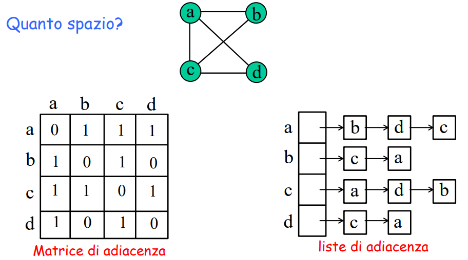
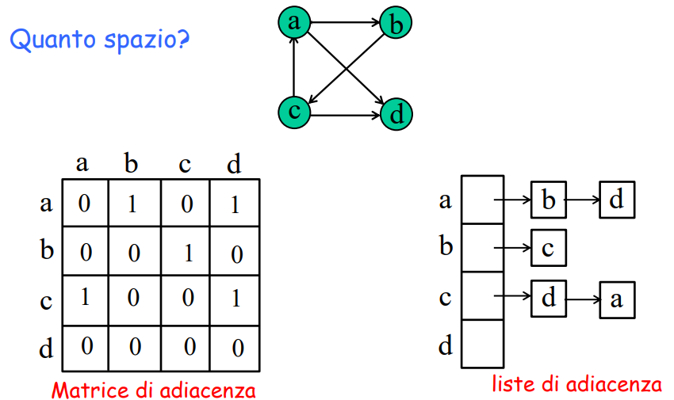
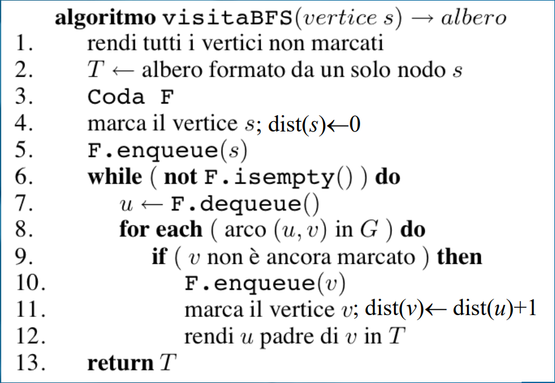
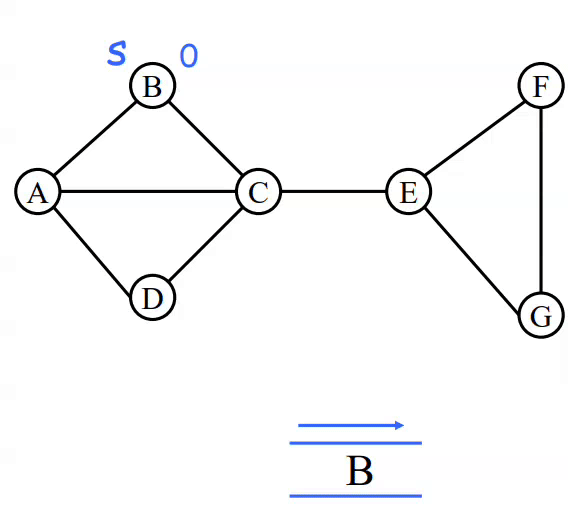
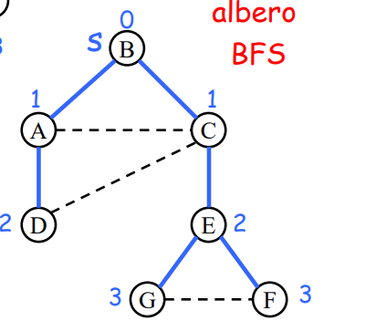
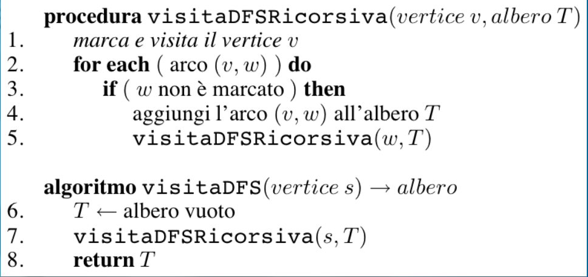
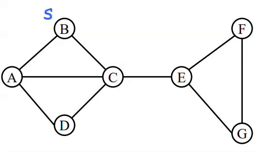
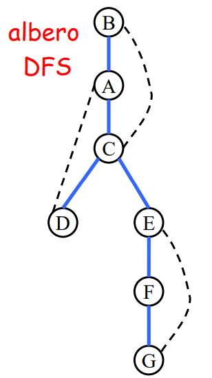

#Algoritmi 

# Visite di grafi

### Strutture dati per rappresentare grafi

#### Grafi non diretti

Con l'implementazione della *Matrice di adiacenza* riesco a "mappare" nodo per nodo, inserendo 1 nella cella se è presente un arco, 0 altrimenti.

$\Rightarrow$ **Costo:** O($n^2$)

Mentre l'implementazione rispetto alla *Lista di adiacenza* permette di visualizzare in meno tempo la mappatura.

$\Rightarrow$ **Costo:** O(m + n), dove *m* è pari al # di gradi del grafo e *n* alla lunghezza della lista (nodo->nodo-> ....)

*OPERAZIONE:* 

elenco archi incidenti in v:              O(n) per la *matrice di a.*         O(δ(v)) per la *lista di a.*

c'è arco (u,v) ?                                 O(1)                                          O(min { δ(u)} , δ(v)} )

#### Grafi diretti

Nei grafi diretti, pur avendo dei percorsi obbligatori da seguire il costo di entrambe le strutture rimangono asintoticamente equivalenti alle precedenti

*Matrice di adiacenza:* **Costo ->** O($n^2$)
*Lista di adiacenza:* **Costo ->** O(m + n)

*OPERAZIONE:* 

elenco archi incidenti in v:              O(n) per la *matrice di a.*         O(δ(v)) per la *lista di a.*

c'è arco (u,v) ?                                 O(1)                                          O(δ(u)) 

### Algoritmi di visita di un grafo

#### Scopo e tipi di visita

- Una visita di un grafo G permette di esaminare i nodi e gli archi di G *in modo sistematico* (se G è connesso).
- Genera un *albero* di visita.
- Problema di base in molte applicazioni
- Esistono vari tipi di visite con diverse proprietà:
	- *visite in ampiezza (BFS = Breadth First Search)*
	- *visite in profondità (DFS = Depth First Search)*

#### Visite in ampiezza / BFS
Dato un grafo *G* (non pesato) e un nodo *s*, trova tutte le *distanze / cammini minimi* da *s* verso ogni altro nodo *v*.

**Pseudocodice:**

*Implementazione grafica:*

Non incremento mai nodi già visitati, mi assicuro di segnare in modo corretto le distanze da *s*.

Alla fine della visita BFS mi ritrovo un albero costruito in questo modo:

##### Costo Visita BFS

Il tempo di esecuzione dipende dalla struttura dati utilizzata per rappresentare il grafo (e dalla connettività o meno del grafo rispetto ad *s*):
- Utilizzando la BFS su una *matrice di adiacenza* il costo è pari a O($n^2$)
- Implementando una *lista di adiacenza* il costo è pari a O(m + n)

**Osservazioni**:
1.  Si noti che se il grafo è connesso allora *m* $\geq$ *n-1* e quindi *O(m + n) = O(m)*
2. Ricordando che *m* $\leq$ *n(n-1)/2*, si ha O(m +n) = O($n^2$) 
  $\Rightarrow$ per m=o($n^2$) la rappresentazione mediante *liste di adiacenza* è **temporalmente più efficiente**.

**TEOREMA:** 

Per ogni nodo *v*, il livello di *v* nell'albero BFS è pari alla distanza di *v* dalla sorgente *s* (sia per grafi orientati che non orientati).

*dimostrazione informale*
- All'inizio inserisco *s* in **F** (si trova a distanza 0 da se stesso) -> livello = 0 , *s* è l'unico nodo a distanza 0.
- Estraggo *s* e guardo tutti i suoi vicini (archi uscenti), questi sono tutti i nodi a distanza 1 da *s*, li inserisco in **F** -> livello = 1 . Ora in **F** ho *tutti* i nodi a distanza 1.
- Estraggo uno a uno tutti i nodi di livello / distanza 1 e per ognuno guardo tutti i suoi vicini (archi uscenti), i vicini non marcati sono a distanza 2 da *s*, li inserisco in **F** -> livello = 2, quando ho estratto e visitato tutti i nodi di livello 1, in **F** ho *tutti* i nodi a distanza 2 da *s*.
- Estraggo uno a uno tutti i nodi di livello / distanza 2 e per ognuno guardo tutti i suoi vicini (archi uscenti), i vicini non marcati sono a distanza 3 da *s*....

#### Visita in profondità

**Pseudocodice:**

*Implementazione grafica:*

Alla fine della visita DFS mi ritrovo un albero costruito in questa maniera:

##### Costo Visita DFS
Il tempo di esecuzione dipende dalla struttura dati usata per rappresentare il grafo (e dalla connettività o meno del grafo rispetto ad *s*):
- *Liste di adiacenza*: O(m+n)
- *Matrice di adiacenza*: O($n^2$)

##### Proprietà dell'albero DFS radicato in *s*
- Se il grafo è *non orientato*, per ogni arco **(u,v)** si ha:
	- **(u,v)** è un arco dell'albero DFS oppure i nodi *u* e *v* sono l'uno discendente / antenato dell'altro
- Se il grafo è *orientato*, per ogni arco **(u,v)** si ha:
	- **(u,v)** è un arco dell'albero DFS oppure i nodi *u* e *v* sono l'uno discendente / antenato dell'altro, oppure **(u,v)** è un arco **trasversale a sinistra**, ovvero il vertice *v* è in un *sottoalbero* visitato precedentemente ad *u*.