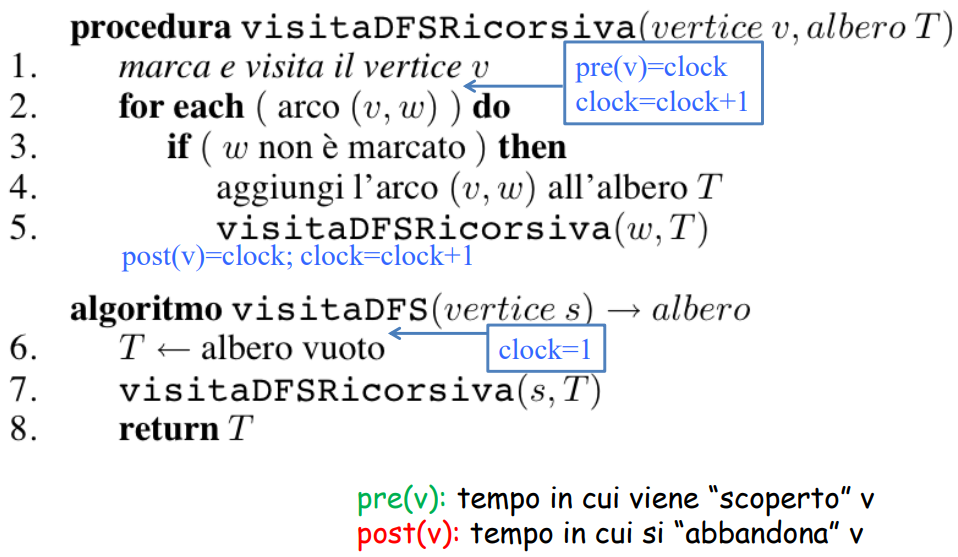
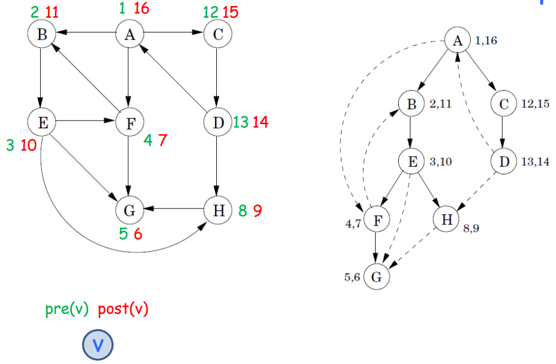
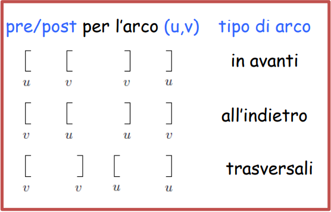
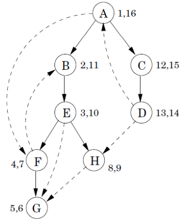

#Algoritmi 

### Usi meno scontati della visita DFS

#### Tenere il tempo 

**Pseudocodice:**

**Quando non tutti i nodi sono raggiungibili dal punto di partenza:**
 

*Costo:* O(n+m) n -> (numero di vertici), m -> (numero di archi)

**Esempio:**

Parto dal *pre(v)* minimo, *se* il successivo non è marcato $\Rightarrow$ elem precedente ++

**Proprietà:**

Per ogni coppia di nodi u e v, gli intervalli [pre(u),post(u)] e [pre(v),post(v)] o sono disgiunti o l'uno è contenuto nell'altro.

u è un antenato di v nell'albero DFS, se pre(u) < pre(v) < post(v) < post(u) condizione che rappresentiamo così:

[ u    [ v   v ]   u]

**Riconoscere i tipi di arco:**

### Cicli, DAG e ordinamenti topologici

**Riconoscere la presenza di un ciclo in un grafo diretto**

Algoritmo:
Fare una visita DFS e controllare se c'è un arco all'indietro

Proprietà: 
Un grafo diretto G ha un ciclo se e solo se la visita DFS rivela un arco all'indietro.

($\Leftarrow$): se c'è un arco all'indietro, chiaramente G ha un ciclo.
($\Rightarrow$): se c'è ciclo < $v_0$ , $v_1$ , .... , $v_k$ =$v_0$ >
	sia $v_i$ il primo nodo scoperto nella visita
	poiché $v_{i-1}$ è raggiungibile da $v_i$ , visito $v_{i-1}$ prima di terminare la visita di $v_i$ 
    allora ($v_{i-1}$ , $v_i$) è un arco all'indietro.

**Definizione:** 
Un grafo diretto aciclico (DAG) è un grafo diretto G che non contiene cicli (diretti).

**Definizione:**
Un ordinamento topologico di un grafo diretto G = (V,E) è una funzione biettiva $\sigma$ : V -> {1,2,...,n} tale che per ogni arco (u,v) $\in$ E, $\sigma$(u) < $\sigma$(v)

![[image-150.png|604x212]]

#### Reti delle dipendenze

![[image-151.png|298x205]]

nodi: compiti da svolgere
arco (u,v): u deve essere eseguito prima di v

Problema:
Trovare un ordine in cui eseguire i compiti in modo da rispettare le dipendenze.

![[image-152.png|580x189]]

#### Dag che ammettono ordine topologico

**Teorema:**
Un grafo diretto G ammette un ordinamento topologico se e solo se G è un DAG.

dim. 
($\Rightarrow$):
per assurdo: sia $\sigma$ un ordinamento topologico di G 

e sia < $v_0$ , $v_1$ , .... , $v_k$ = $v_0$ > un ciclo
allora $\sigma$($v_0$) < $\sigma$($v_1$) < ... < $\sigma$($v_{k-1}$) < $\sigma$($v_k$)=$\sigma$($v_0$)

($\Leftarrow$): 

Algoritmo: 
Fare una visita DFS e restituisci i nodi in ordine decrescente rispetto ai tempi di fine visita post(v).

![[image-153.png]]

**Complessità temporale:**
Se G è rappresentato con *liste di adiacenza* $\Theta$(n +m)

**Esempio:**
![[image-154.png]]

**Correttezza**
Per ogni coppia di nodi *u* e *v*, gli intervalli [pre(u),post(u)] e [pre(v),post(v)]
o sono disgiunti o l'uno è contenuto nell'altro

![[image-155.png]]

Non ci possono essere archi all'indietro

Un **algoritmo alternativo**

![[image-156.png]]

![[Screenshot From 2025-12-17 16-43-11.gif]]

#### Componenti fortemente connesse 

Una componente fortemente connessa di un grafo G = (V,E) è un insieme massimale di vertici C $\subseteq$ V tale che per ogni coppia di nodi u e v in C, u è raggiungibile da v e v è raggiungibile da u. 

![[image-157.png]]

Massimale: se si aggiunge un qualsiasi vertice a C la proprietà non è più vera.

![Grafo delle componenti fortemente connesse di G][image-158.png]

E' sempre un DAG

#### Come calcolare le componenti fortemente connesse di un grafo diretto

![[image-157.png]]

Proprietà 1: Se si esegue la procedura *visitaDFSricorsiva* a partire da un nodo u la procedura termina dopo che tutti i nodi raggiungibili da u sono stati visitati.

Idea: Eseguire una visita a partire da un nodo di una *componente pozzo*, "eliminare" la componente e ripetere.

![][image-158.png]

**Come trovo una componente pozzo?**

![[image-159.png]]

Proprietà 2: Se C e C' sono due componenti e c'è un arco da un nodo in C verso uno in C', allora il più grande valore post() in C è maggiore del più alto valore di post() di C'. 

dim : se la DFS visita prima C' di C: banale. 
Se visita prima C, allora si ferma dopo che ha raggiunto tutti i nodi di C e C' e termina su un nodo di C.

$\Rightarrow$ Proprietà 3 : il nodo che riceve da una visita DFS il valore più grande di post() appartiene a una componente sorgente.
![[image-160.png]]

Avevamo bisogno di una componente pozzo?

idea: invertiamo gli archi!

![[image-161.png]]

**Pseudocodice:**
![[image-162.png]]

**Complessità temporale:** 
Se G è rappresentato con liste di adiacenza -> $\Theta$(n+m)

![[Screenshot From 2025-12-18 10-53-57.gif]]