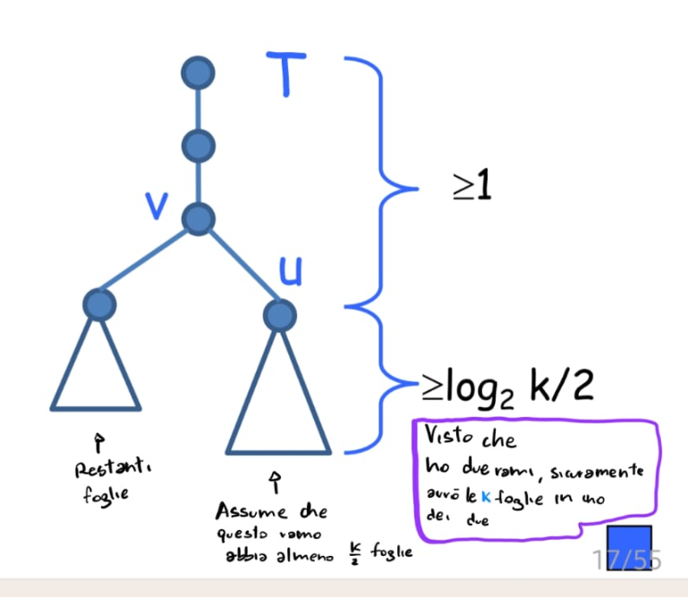
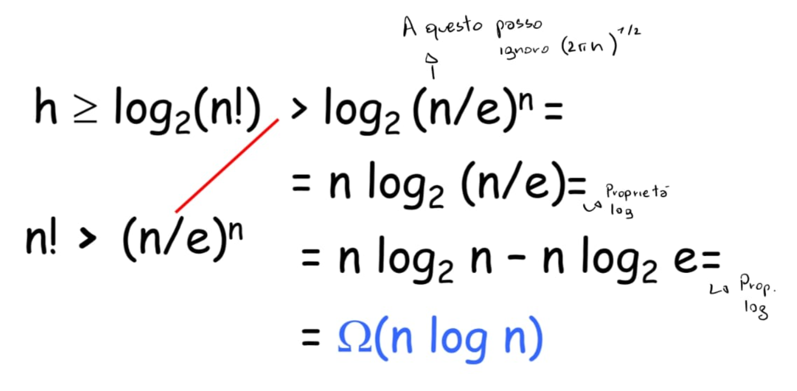
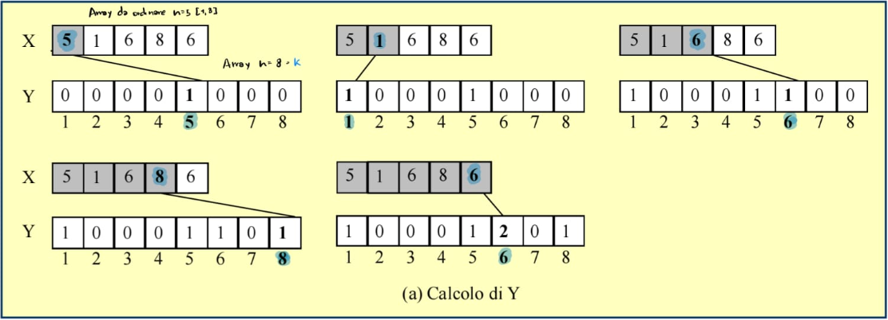
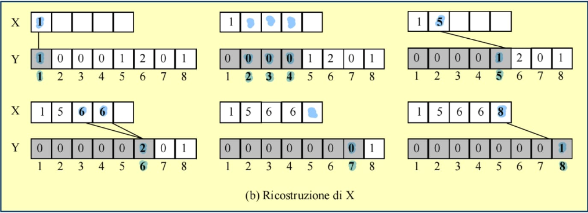
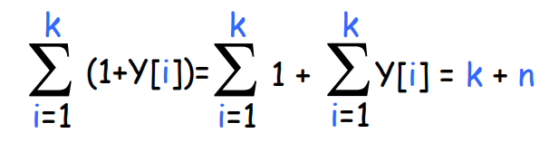
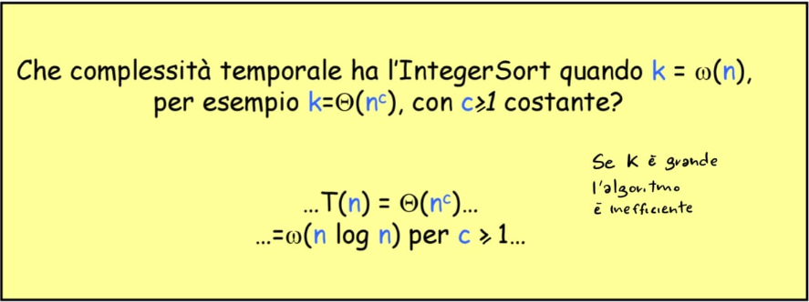
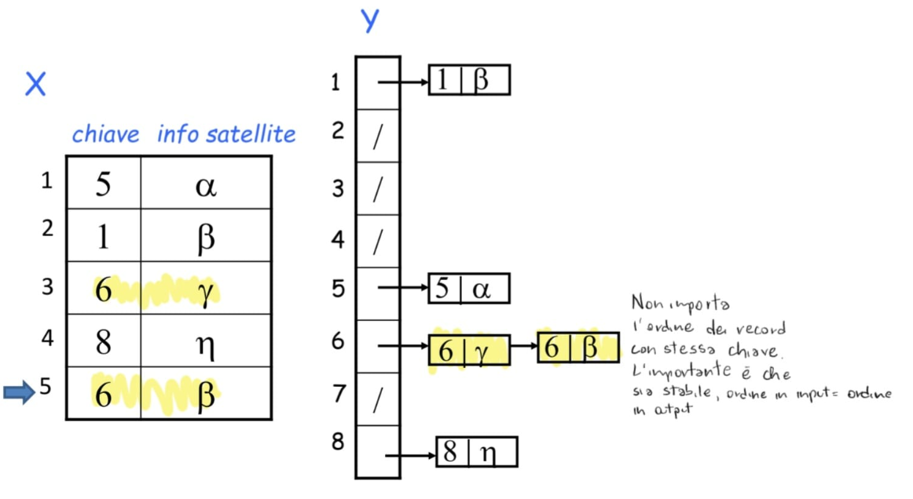
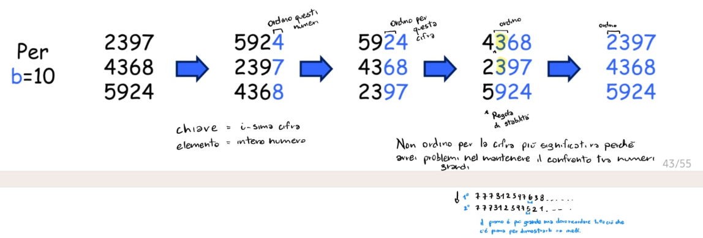

#Algoritmi 
### Sommario 

- Delimitazioni inferiori e superiori (di algoritmi e programmi)
- Quanto velocemente si possono ordinare n elementi? 
	- Una soglia (asintotica) di velocità sotto la quale non si può scendere: un lower bound  
		- per una classe di algoritmi "ragionevoli" --> quelli basati su confronti
	- Una tecnica elegante che usa gli alberi di decisione
- E se si esce da questa classe di algoritmi? 
	- integer sort e bucket sort (per interi "piccoli")
	- radix sort (per interi più grandi)
### Delimitazioni inferiori e superiori (di algoritmi e problemi)

**Delimitazioni superiori (upper bound) inferiori (lower bound) di un Algoritmo:**

Definizione per Upper Bound 
Un algoritmo A ha complessità (costo di esecuzione) O(f(n)) rispetto ad una certa risorsa di calcolo, se la quantità r(n) di risorda utilizzata da A nel caso peggiore su istanze di dimenione n verifica la relazione r(n)=O(f(n)).

Definizione per Lower Bound 
Un algoritmo A ha complessità (costo di esecuzione) Ω(f(n))  rispetto ad una certa risorsa di calcolo, se la quantità r(n) di risorsa usata da A nel caso peggiore su istanze di dimensione n verifica la relazione r(n)=Ω(f(n)).

**Delimitazioni superiori (upper bound) inferiori (lower bound) di un Problema:**

Definizione per Upper Bound 
Un problema P ha complessità O(f(n)) rispetto ad una risorsa di calcolo se esiste un algoritmo che risolve P il cui costo di esecuzione rispetto quella risorsa è O(f(n)).

Definizione per Lower Bound 
Un problema P ha complessità Ω(f(n)) rispetto ad una risorsa di calcolo se ogni algoritmo che risolve P ha costo di esecuzione nel caso peggiore Ω(f(n)) rispetto quella risorsa.

#### Ottimalità di un algoritmo 

Definizione 
Dato un problema P con complessità Ω(f(n)) rispetto ad una risorsa di calcolo, un algoritmo che risolve P è (asintoticamente) ottimo se ha costo di esecuzione O(f(n)) rispetto a quella risorsa.

#### Complessità temporale del problema dell'ordinamento 

- Upper Bound: O($n^2$)
	-Insertion Sort, Selection Sort, Quick Sort, Bubble Sort
	
- Un upper Bound migliore: O(log n) 
	-Merge Sort, Heap Sort 
- Lower Bound: Ω(n)
   -banale: ogni algoritmo che ordina n elementi li deve almeno leggere tutti 
   
Abbiamo un gap di log n tra upper bound e lower bound!

Notare: Tutti gli algoritmi citati prima sono algoritmi di ordinamento per confronto.

**Teorema**
Ogni algoritmo basato su confronti che ordina n elementi deve fare nel caso peggiore Ω(n log n) confronti.

Nota: Il # di confronti che un algoritmo esegue è un lower bound al # di passi elementari che esegue.

**Corollario**
Il Merge Sort e l'Heap Sort sono algoritmi ottimi  (almeno dentro la classe di algoritmi basati su confronti).

### Albero di decisione
Gli algoritmi di ordinamento per confronto possono essere descritti in modo astratto in termini di alberi di decisione.

Un generico algoritmo di confronto lavora nel modo seguente:
	- confronta due elementi $a_i$ ed $a_j$  (ad esempio effettua il test $a_i \leq a_j$).
	- a seconda del risultato - riordina e/o decide il confronto successivo da eseguire.

Albero di decisione - Descrive i confronti che l'algoritmo esegue quando opera su un input di una determinata dimensione. I movimenti dei dati e tutti gli altri aspetti dell'algoritmo vengono ignorati.

#### Alberi di decisione
- Descrive le  diverse sequenze di confronti che A potrebbe fare su istanze di dimensione n
- Nodo interno (non foglia): i : j
	-modella il confronto tra $a_i$ e $a_j$
	 
- Nodo foglia: 
	-modella una risposta (output) dell'algoritmo: permutazione degli elementi 

I numeri segnati nell'albero corrispondono ai pedici dell'input.
**Osservazioni:**
1.	L'albero di decisione non è associato ad un problema o ad un algoritmo
2.  L'albero di decisione è associato ad un algoritmo e a una dimensione dell'istanza
3.  L'albero di decisione descrive le diverse sequenze di confronti che un certo algoritmo può eseguire su istanze di una data dimensione
4.  L'albero di decisione è una descrizione alternativa dell'algoritmo (customizzato per istanze di una certa dimensione)

**Proprietà:**
1) Per una particolare istanza, i confronti su essa rappresentano un cammino radice-foglia.
2) L'algoritmo segue un cammino diverso a seconda delle caratteristiche dell'istanza: Caso peggiore = cammino più lungo.
3) Il numero di confronti nel caso peggiore è pari all'altezza dell'albero di decisione.
4) Un albero di decisione di un algoritmo (corretto) che risolve il problema dell'ordinamento di n elementi deve avere necessariamente almeno n! foglie. 

**Lemma** 
Un albero binario T con k foglie, ha altezza almeno $log_2 k$ 

dim (per induzione su k)
caso base: k=1            altezza almeno $log_2$ 1 = 0
caso induttivo: k>1

considera il nodo interno v più vicino alla radice che ha due figli (v potrebbe essere la radice), nota che v deve esistere perché k>1.

v ha almeno un figlio u che è radice di un (sotto)albero che ha almeno k/2 foglie e < k foglie.

T ha altezza almeno 
1 + $log_2 k/2$ = 1+$log_2 k$ - $log_2 2$ = $log_2 k$

#### Il lower bound Ω(n log n) 
- Consideriamo l'albero di decisione di un qualsiasi algoritmo che risolve il problema dell'ordinamento di n elementiù
- L'altezza h dell'albero di decisione è almeno $log_2$ (n!) 
- Formula di Stirling: n! $\approx$ $(2\pi n)^{1/2} \cdot (n/e)^n$  

Può un algoritmo basato su n confronti ordinare n interi piccoli, compresi fra 1 e k= O(n), in (asintoticamente) meno di n log n ?

.....no la dimostrazione funziona anche sotto questa ipotersi!
La grandezza non cambia il modus operandi dell'albero decisionale

### Integer Sort: fase 1

Per ordinare n interi con valori in [1,  k] oppure [0 , k]

Mantiene un array Y di k contatori tale che  Y[x] = numero di volte che il valore x compare in X.

Con il vettore X originale conto il numero di elementi in esso incrementando Y[x] di 1 ogni volta che ne trovo uno.

Se X[i] = n  $\Rightarrow$ Y[X[i]] ++

### Integer Sort: fase 2

Scorre Y da sinistra verso destra e, se Y[x] = k, scrive in X il valore x per k volte.

#### PseudoCodice 
>[!example]
>IntegerSort (X,k)
>1. Sia Y un array di dimensione k
>2. **for** i=1 **to** k **do** Y[i] = 0
>3. **for** i =1 **to** n **do** incrementa Y[X[i]]
>4. j=1
>5. **for** i=1 **to** k **do**
>6. ---------- **while**(Y[i] > 0) **do**
>7. -------------- X[j] = i
>8. -------------- incrementa j
>9. -------------- decrementa Y[i]

**Analisi**:
1.  Creo un array in tempo costante, O(1)
2.  Inizializzo un array con tutti zeri, ha comunque costo linerare: O(k)
3.  Incremento gli elementi in Y[i] che trovo passo-passo nel vettore X, O(n)
4.  Incremento l'indice di X, O(1)
5.  Scorro l'array Y, O(k)
Nelle righe 6. / 7. / 8. / 9. ricerco gli elementi del vettore Y e li riassegno in X.
Per un i fissato il # volte eseguite è al più 1 + Y[i] , $\Rightarrow$ O(k + n)

### IntegerSort: analisi

- Tempo O(1) + O(k) = O(k) per inizializzare Y a 0.
- Tempo O(1) + O(n) = O(n) per calcolare i valori dei contatori.
- Tempo O(n+k) per ricostruire X.

$\Rightarrow$ O(n+k)
Tempo lineare se k=O(n) 

Contraddice il lower bound di Ω(n log n) ?
No, perché l' IntegerSort non è un algoritmo basato su confroniti!

### Bucket Sort

Per ordinare n record (strutture base con cui si scrivono tabelle) con chiavi intere in [1,k]

- Esempio: ordinare n record con campi:
	-nome, cognome, anno di nascita, matricola.... 

Input del problema:
- n record mantenuti in un array
- ogni elemento dell'array è un record con: 
	-campo chiave (rispetto al quale ordinare) 
	-altri campi associati alla chiave (informazione satellite)

#### Come operare
- Si mantenie un array di liste, anziché di contatori, operando come per IntegerSort
- La lista Y[i] conterrà gli elementi con chiave uguale a i
- Successivamente si concatenano le liste 
	Tempo O(n+k) come per IntegerSort 

Si opera come per l' IntegerSort, ad ogni chiave della lista di record corrisponde un'indice della lista Y[]. 
Inserisco fino a terminare tutti i record. 

Caso importante, molteplicità di una chiave:

#### PseudoCodice
>[!example]
>BucketSort (X, k)
>1. --Sia Y un array di dimensione k
>2. --**for** i=1 **to** k **do** Y[i] = lista vuota    --*inizializzo*
>3. --**for** i=1 **to** n **do**
>4. ----appendi il record X[i] alla lista Y[chiave(X[i])]  -- *//preparo Y con pos=chiavi di X*
>5. --**for** i=1 **to** k **do**
>6. ----copia ordinatamente in X gli elementi della lista Y[i]

#### Stabilità 
- Un algoritmo è stabile se preserva l'ordine iniziale tra elementi con la stessa chiave
- Il BucketSort è stabile se si appendendo gli elementi di X in coda alla opportuna lista Y[i]

### RadixSort 

- Ordina n interi con valori in [1,k]
- Rappresentiamo gli elementi in base b, ed eseguiamo una serie di BucketSort
- Partiamo dalla cifra meno significativa verso quella più significativa:
	 -Ordiniamo per l'i-sima cifra con una passata di BucketSort 
	 -L' i-sima cifra è la chiave, il numero informazione satellite
	 -L' i-sima cifra è un intero in [0,b-1]

#### Correttezza

- Se x e y hanno una diversa t-esima cifra, la t-esima passata di BucketSort li ordina
- Se x e y hanno la stessa t-esima cifra, la proprietà di stabilità del BucketSort li mantiene ordinati correttamente
Dopo la t-esima passata di BucketSort, i numeri sono correttamente ordinati rispetto alle t cifre meno significative

Esempio:    2397
		   4368
		   5924 
	le cifre meno significative sono ordinate

#### Tempo di correttezza

- O($log_b$ k) passate di BucketSort
  -# di cifre per rappresentare il valore massimo k in base b: O($log_b$ k)
- Ciascuna passata richiede tempo O(n + b)
	-in ogni passata la chiave è un intero in [0, b-1]

	O( (n+b) ($log_b$ k) )

Se b = Θ(n), si ha O(n $log_n$ k) = * O ( n ( log k/log n) )

* $log_2$ k = $log_n$ k $\cdot$ $log_2$ n

$\Rightarrow$ Tempo lineare se k = O($n^c$), c costante

Esempio:

- Si supponga di voler ordinare $10^6$ numeri da 32 bit
- Come scelgo la base b ?
- $10^6$ è compreso fra $2^{19}$ e $2^{20}$ 
- Scegliendo b = $2^{16}$ si ha:
	-sono sufficienti 2 passate di BucketSort
    -ogni passata richiede tempo lineare 
