#Algoritmi 
# Strutture dati elementari
### Gestione di collezioni di oggetti
### Tipi di dato
 - Specifica una collezione di oggetti e delle operazioni di interesse su tale collezione (Esempio: inserisci, cancella, visita).
### Stuttura dati:
- Organizzazione dei dati che permette di memorizzare la collezione e supportare le operazioni di un tipo di dato usando meno risorse di calcolo possibile.

#### Il tipo di dato Dizionario

**tipo** Dizionario:

**dati**:
	un insieme S di coppie (*elem*,*chiave*).

**operazioni**:
	insert(*elem e*,*chiave k*)
		aggiunge a S una nuova coppia (*e*,*k*) .
	delete(*chiave k*)
		cancella da S la coppia con chiave k.
	search(*chiave k*) --> elem
		se la chiave k è presente in S restituisce l'elemento *e* ad essa associato, e *null* altrimenti.

#### Il tipo di dato Pila

**tipo** Pila:

**dati**: 
	una sequenza S di elementi.
	
**operazioni**:
	isEmpty() --> *result*
		restituisce true se S è vuota, e *false* altrimenti.
	push(*elem e*)
		aggiunge *e* come ultimo elemento di S. 
	pop() --> *elem*
		toglie da S l'ultimo elemento e lo restituisce.
	top() --> *elem* 
		restituisce l'ultimo elemento di S (senza toglierlo da S).

#### Il tipo di dato Coda

**tipo** Coda:

**dati**:
	una sequenza S di n elementi.

**operazioni**:
	isEmpty() --> **result**
		restituisce true se S è vuota, e false altrimenti.
	enqueue(*elem e*)
		aggiunge *e* come l'ultimo elemento di S.
	dequeue() -->*elem*
		toglie da S il primo elemento e lo restituisce.
	first() --> *elem* 
		restitusce il primo elemento di S (senza toglierlo da S).

## Tecniche di rappresentazione dei dati

### Rappresentazioni indicizzate:
- I dati sono contenuti (principalmente) in array.
#### Proprietà
- Array: collezione di celle numerate che contengono elementi di un tipo prestabilito.
	- Proprietà forte / Vantaggio: gli indici delle celle di un array sono numeri consecutivi, accesso agli elementi in tempo costante.
	- Proprietà debole /  Svantaggio: non è possibile aggiungere nuove celle ad un array.
#### Pro e Contro 
- Pro: accesso diretto ai dati mediante indici.
- Contro: dimensione fissa (riallocazione array richiede tempo lineare).

### Rappresentazioni collegate:
- I dati sono contenuti in record collegati fra loro mediante puntatori.

#### Proprietà 
- i costituenti di base sono i *record*.
- i record sono numerati tipicamente con il loro *indirizzo di memoria*.
- record creati e distrutti individualmente e dinamicamente.
- il collegamento tra un record A e un record B è realizzato tramite un *puntatore*.
- Proprietà forte / Vantaggio: è possibile aggiungere o togliere record a una struttura collegata.
- Proprietà debole / Svantaggio: gli indirizzi dei record di una struttura collegata non sono necessariamente consecutivi.

#### Pro e contro
- Pro: dimensione variabile (aggiunta e rimozione record in tempo costante).
- Contro: accesso sequenziale ai dati.

### Esempi di strutture collegate

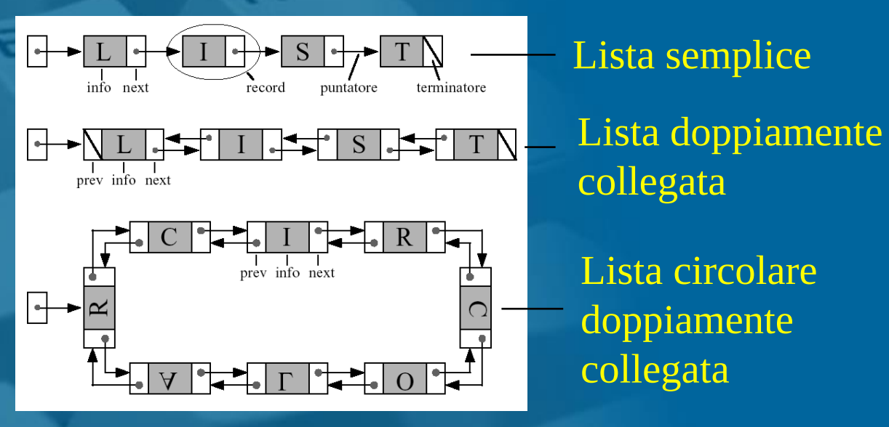

## Realizzazione di un dizionario 

Metodo più semplice: **array non ordinato** (sovradimensionato)

**Insert** --> costa O(1) - inserisco dopo ultimo elemento.
**Search** --> costa O(n) - devo scorrere l'array. 
**Delete** --> costa O(n) 

------------------------------------------------------------------------
**Array ordinato**: 
**Search** --> O(log n) - ricerca binaria
**Insert** --> O(n) - Ho bisogno di:
			   **O(log n)** confronti --> per trovare la giusta posizione in cui inserire l'elemento.
			   **O(n)** trasferimenti --> per mantenere l'array ordinato.
			   Perciò: **O(n)** + **O(log n)** = **O(n)**
**Delete** --> O(n) (come per *insert*)

------------------------------------------------------------------------

Con le **liste** 

**Lista non Ordinata**

**Search** - O(n) 
**Insert** - O(1) 
**Delete** - O(n)

**Lista Ordinata**

**Search** - O(n)         non posso usare la ricerca binaria 
**Insert** - O(n)           devo mantenere ordinata la lista. 
**Delete** - O(n)

## Alberi

Organizzazione gerarchica dei dati
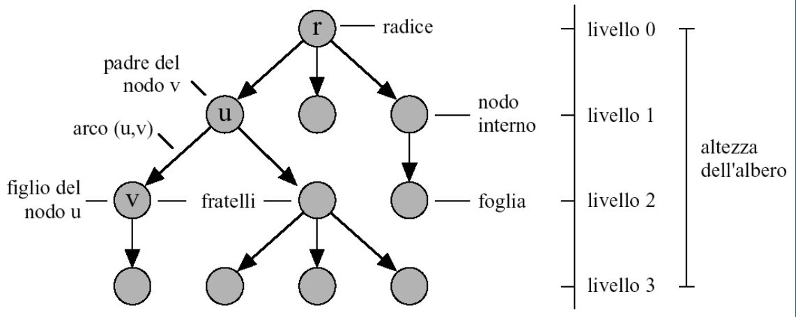

Dati contenuti nei **nodi**, relazioni gerarchiche definite dagli **archi** che li collegano.
Grado di un nodo: numero dei suoi figli 
**albero d-ario, albero d-ario completo**

u **antenato** di v se u è raggiungibile da v risalendo di padre in padre
v **discendente** di u se u è un antenato di v

### Rappresentazioni indicizzate di alberi 

*Idea*: ogni cella dell''array contiene 
- Le informazioni di un nodo
- Eventualmente altri indici per raggiungere altri nodi
*Vettore dei padri*
Per un albero con *n* nodi uso un array P di dimensione (almeno) *n*
Una generica cella *i* contiene una coppia (*info*, *parent*), dove: 
	*info*: contenuto informativo del nodo *i*
	*parent*: indice (nell'array) del nodo padre di *i*
*Vettore posizionale* (per alberi d-ari (quasi) completi)

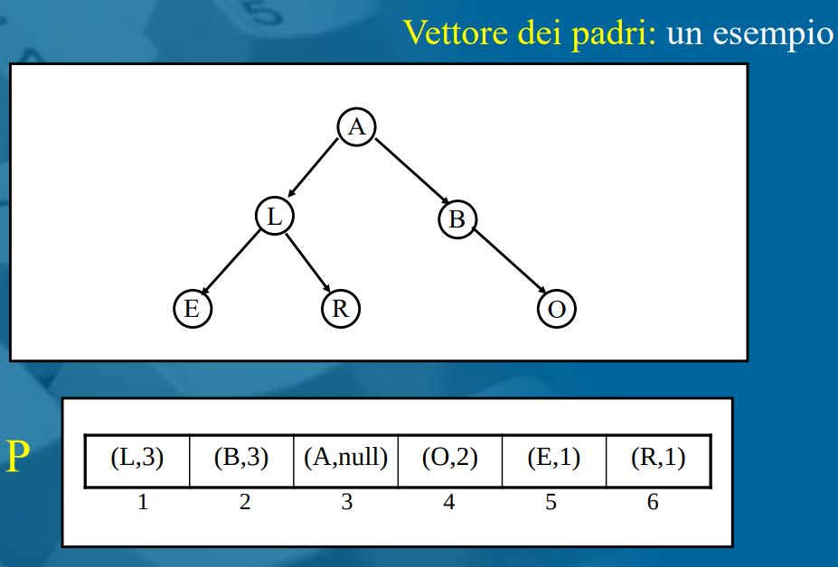

( **P[i].info** , **P[i].parent** ) 
**P[i].info** : contenuto informativo nodo
**P[i].parent** : indice del nodo padre

Osservazioni : 
-# arbitrario di figli
-tempo per individuare il padre di un nodo: O(1)
-tempo per individuare uno o più figli di un nodo: O(n)

Vettore posizionale ( per alberi d-ari (quasi) completi)

-nodi arrangiati nell'array "per livelli"
-indici a partire da 0:
	- j-simo figlio ($j \in {1, ..., d}$) di *i* è in posizione  *d $\cdot$ i* + *j* 
	- il padre di *i* è in posizione $\lfloor (i-1)/d \rfloor$
-indici a partire da 1:
	- j-simo figlio  ($j \in {1, ..., d}$) di *i* è in posizione *d* $\cdot$ *(i-1)* + *j* + *1*
	- il padre di *i* è in posizione $\lfloor(i-2)/d \rfloor +1$ 

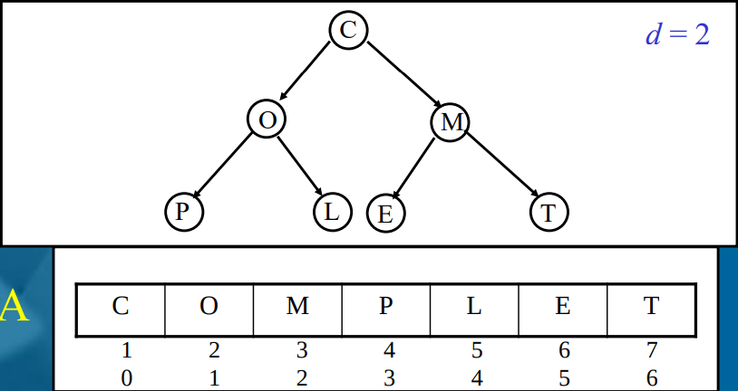
Osservazioni:
-# di figli esattamente d
-solo per alberi completi o quasi completi
-tempo per individuare il padre di un nodo: O(1) 
-tempo per individuare uno specifico figlio di un nodo: O(1)

### Rappresentazioni collegate di alberi 

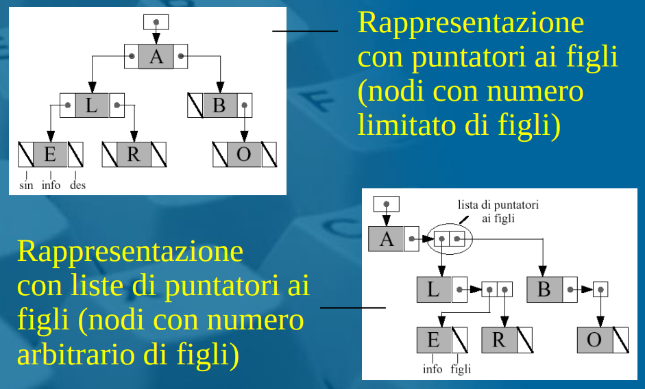
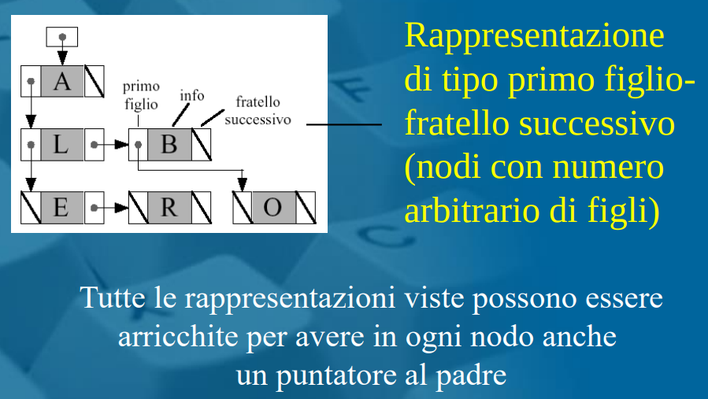

### Visite di alberi 

Algoritmi che consentono l'*accesso sistematico ai nodi e agli archi* di un albero.

Gli algoritmi di visita si distinguono in base al particolare ordine di accesso ai nodi.

### Algoritmo di visita  per alberi binari

#### Algoritmo di visita in profondità

L'algoritmo di visita in profondità (DFS) / (Depth First Search) parte da r (radice) e procede visitando nodi di figlio in figlio, fino a raggiungere una foglia.
Retrocede poi al primo antenato che ha ancora figli non visitati (se esiste) e ripete il procedimento a partire da uno di quei figli.

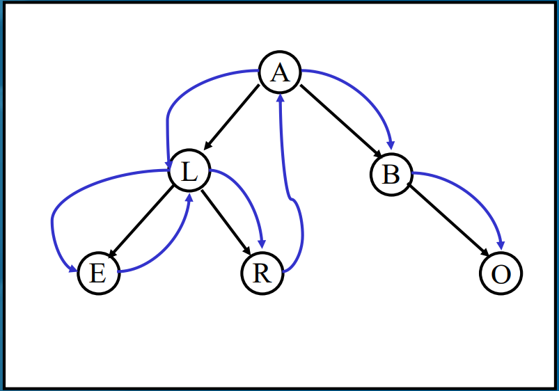

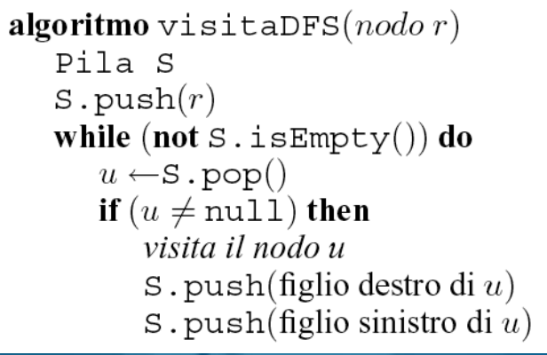

*Complessità temporale*:
- Ogni nodo inserito è estratto dalla Pila.
- Tempo speso per ogni nodo: O(1) (se so individuare i figli di un nodo in tempo costante).
- numero di nodi null inseriti/estratti: O(n).
T(n) = O(n)

*Versione ricorsiva (per alberi binari)* 
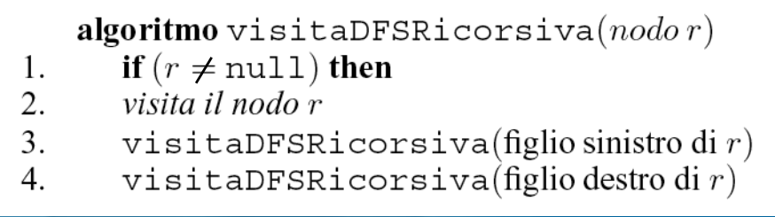

*Visita in preordine*: r (radice), sx (sottoalbero sinistro), dx (sottoalbero dx)
*Visita simmetrica*: sx, r, dx
(scambia riga 2 con 3)
*Visita in postordine*: sin, dx, r
(scambia riga 2 dopo 4)

##### Visita in preordine

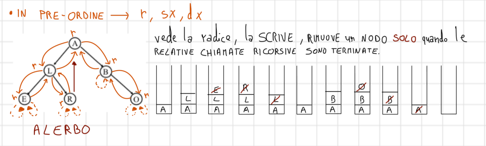

##### Visita simmetrica 

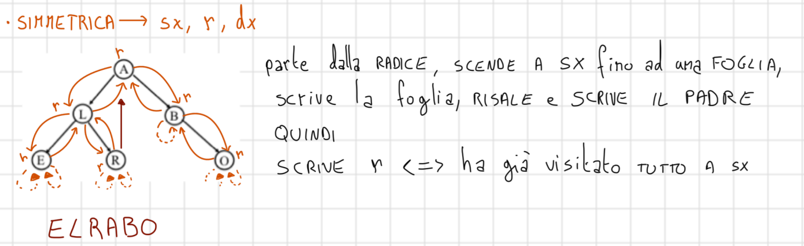

##### Visita in postordine

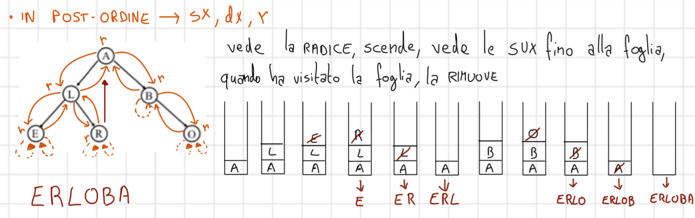

#### Algoritmo di visita in ampiezza 

L'algoritmo di visita in ampiezza (BFS) / (Breadth First Search) parte da r e procede visitando nodi per livelli successivi. Un nodo sul livello può essere visitato solo se tutti i nodi sul livello i-1 sono stati visitati.

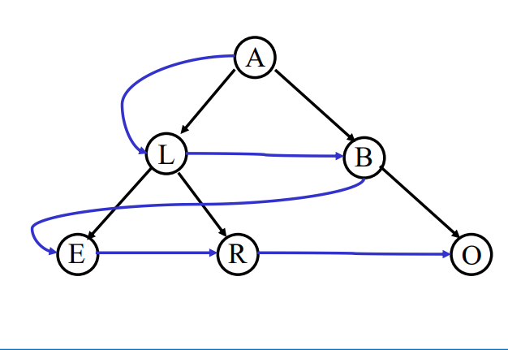

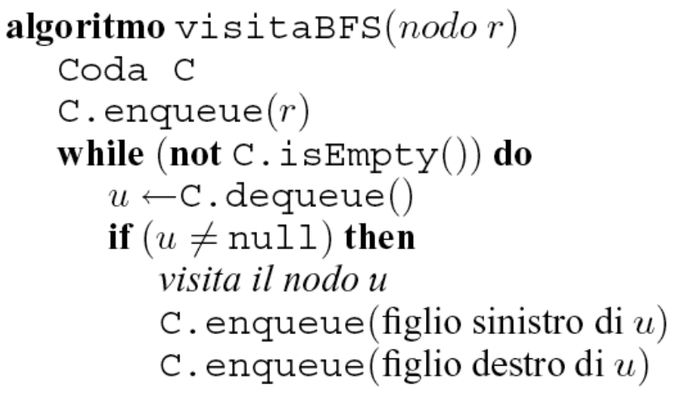

*Complessità temporale*:
- Ogni nodo inserito è estratto dalla Coda una sola volta.
- Tempo speso per ogni nodo: O(1), se so individuare i figli di un nodo in tempo costante.
- numero di nodi null inseriti/estratti: O(n).
T(n) = O(n)

### Utilizzo degli algoritmi di visita

#### Calcolo dell'altezza

Calola (e ritorna) l'altezza di un albero binario con radice r

Complessità temporale: O(n)

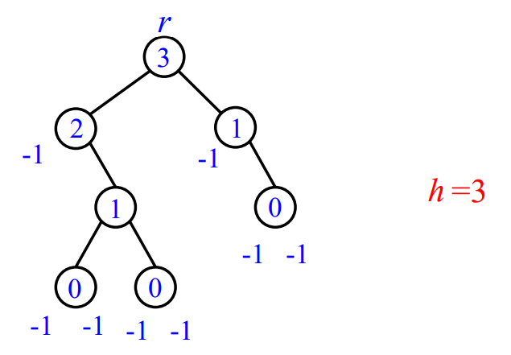

#### Calcolare il numero di foglie di un albero

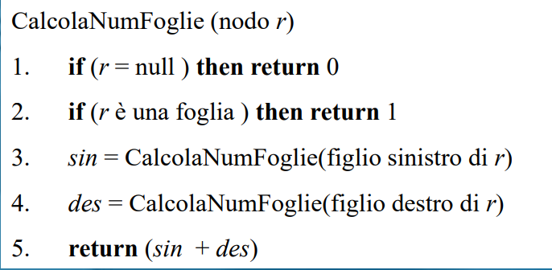

*Complessità temporale*: O(n)

#### Calcolare il grado medio dei nodi dell'albero (numero medio di figli di un nodo *non foglia* )

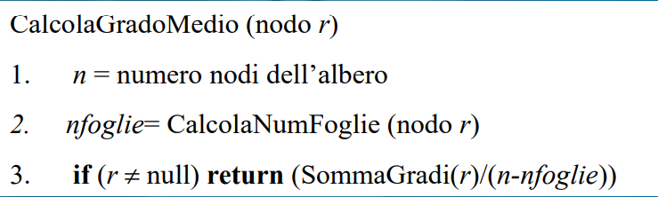

*Complessità temporale*: O(n)

#### Verificare se esiste un nodo dell'albero che abbia un dato contenuto informativo

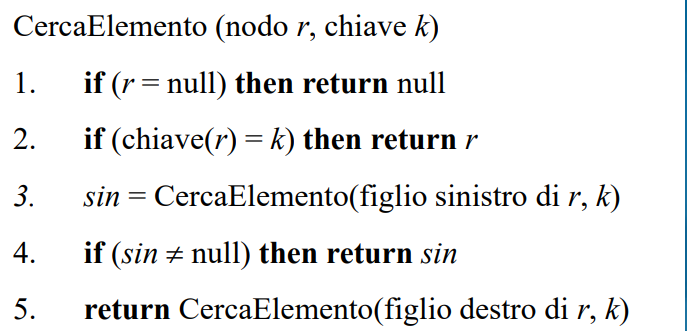

*Complessità temporale*: O(n)
 
Ritorna un nodo dell'albero di radice *r* che ha chiave *k*; se tale nodo non esiste ritorna null.

### Algoritmi utili sugli alberi

#### Problema 1 

*Input*: Un albero binario  T di n nodi, ogni nodo v ha: 
	- valore val(v) > 0
	- colore col(v) $\in$ {R,N}

*Output*: valore del cammino rosso di tipo radice-nodo di valore massimo

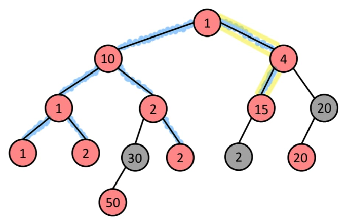

*Risultato*: 20 

Definizioni:
- il valore di un cammino è la somma di valori dei nodi del cammino.
- un cammino è rosso se tutti i suoi nodi sono di colore rosso.

Idea:
 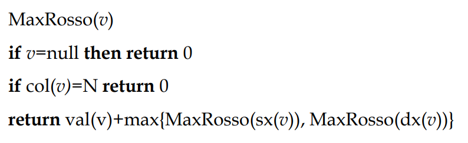
A partire dalla radice, ritorno se presenti i cammini massimi dx e sx dell'albero.

MaxRosso(v)
Restituisce il valore del cammino rosso di valore massimo di tipo v-discendente di v
- Le informazioni vengono "dal basso", sono calcolate rispetto al sottoalbero con radice v.
- Possono essere usate per "passare informazioni" al padre di v.

Complessità: O(n)

####  Problema 2

*Input*: albero binario T di n nodi (rappresentato con record e puntatori), un intero h $\geq$ 0

*Output*: numero di nodi di T con profondità almeno h

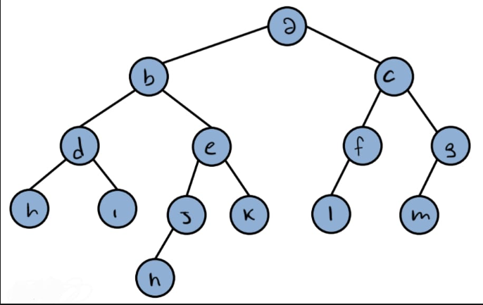

Definizione: 
la profondità di un nodo è la distanza dalla radice, oppure è il  numero di archi.

h=3
Output: 7

BFS -> a , h = 0
	   b, h = 1
	   .
	   .
	   .
	   n, h=4

Idea: 

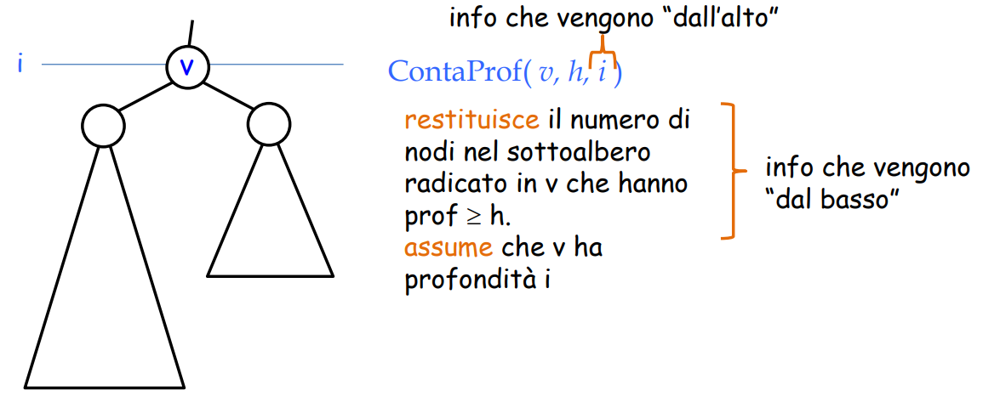

#### Problema 3

*Input*: un albero binario T di n nodi, (rappresentato con record e puntatori), ogni nodo v ha un valore val(v) > 0

*Output*: numero di nodi che soddisfano, somma dei valori degli antenati del nodo = somma dei valori dei discendenti del nodo

Devo trovare almeno un nodo che sommato ai suoi antenati dia lo stesso valore della somma dei suoi discendenti.

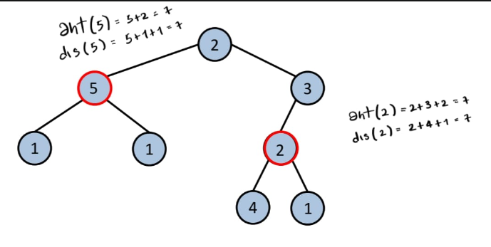

Output: 2

Idea:

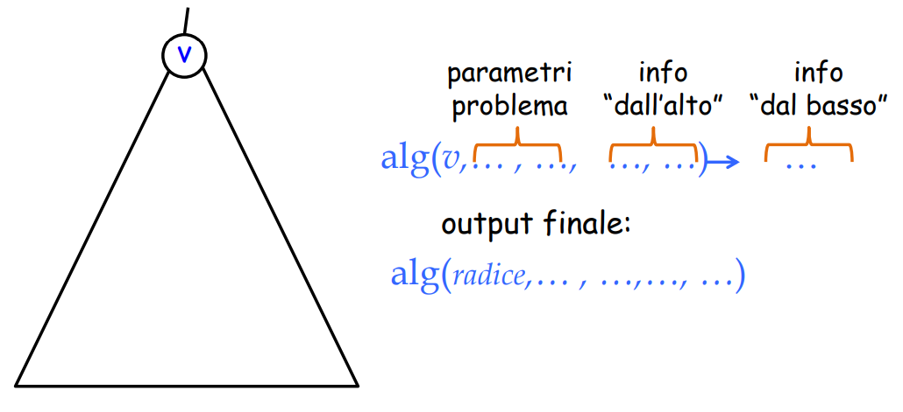

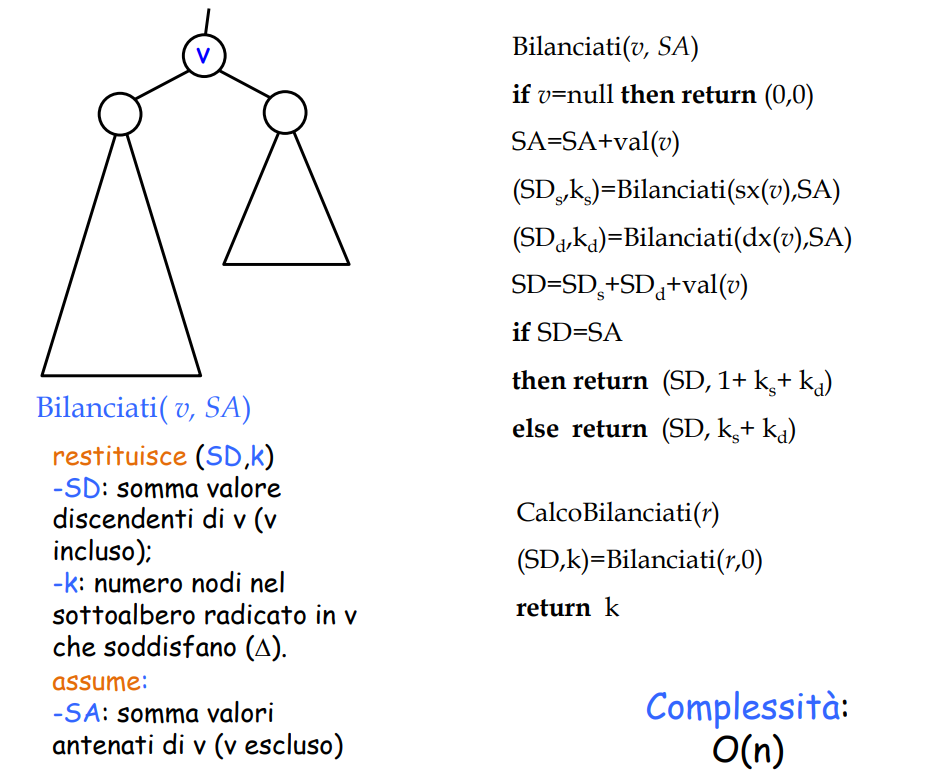