#Algoritmi 
ù# Il problema del dizionario

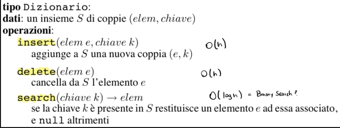

### Come implementare efficientemente un dizionario?

è possibile garantire che tutte le operazioni su un dizionario di n elementi abbiamo tempo O(log n).

Due idee: 
- Definire un albero (binario) tale che ogni operazione richiede tempo O(altezza albero).  Alberi binari di ricerca 

-  Fare in modo che l'altezza dell'albero sia sempre O(log n).
	Alberi AVL

### Alberi binari di ricerca, BST = Binary Search Tree

#### Definizione:

Albero binario che soddisfa le seguenti proprietà:
- Ogni nodo *v* contiene un elemento elem(v) cui è associata una chiave chiave(v) presa da un dominio totalmente ordinato.

Per ogni nodo v vale che:
- Le chiavi nel sottoalbero sinistro di v sono  $\leq$ chiave(v).
- Le chiavi nel sottoalbero destro di v sono > chiave(v).

#### Esempi

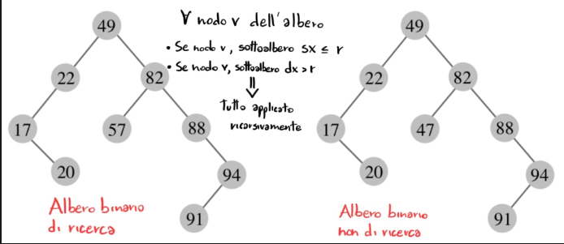

Per calcolare il massimo e il minimo:
- Max = ultimo nodo dx del sottoalbero dx
- Min= ultimo nodo sx del sottoalbero sx 

Per vedere in modo crescente gli elementi dell'albero bisogna visitarlo con una BFS in ordine simmetrico

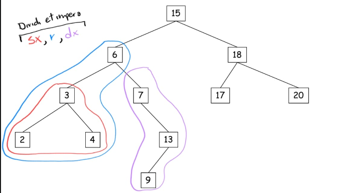

Ordine 2 3 4 6 7 9 13 15 17 18 20

Mentre, per vedere gli elementi in maniera decrescente si modifica la BFS in ordine simmetrico: dx,r,sx.

#### Verifica di correttezza 
Indichiamo con *h* l'altezza dell'albero.
Vogliamo mostrare che la visita in ordine simmetrico restituisce la sequenza ordinata.

Per induzione sull'altezza dell'ABR: h=1
(mostriamolo senza perdita di generalità quando l'albero è completo).

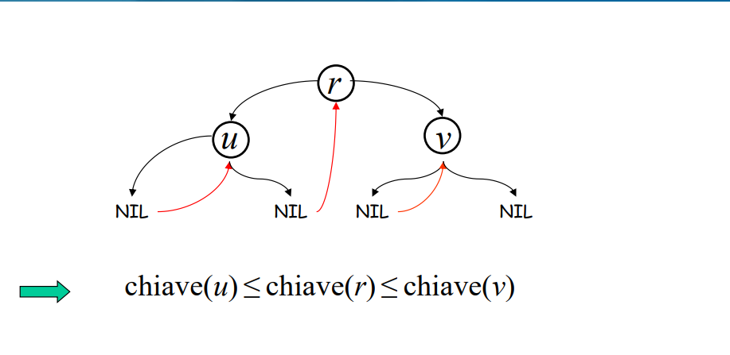

h = generico (ipotizzo che la procedura sia corretta per altezza <h)

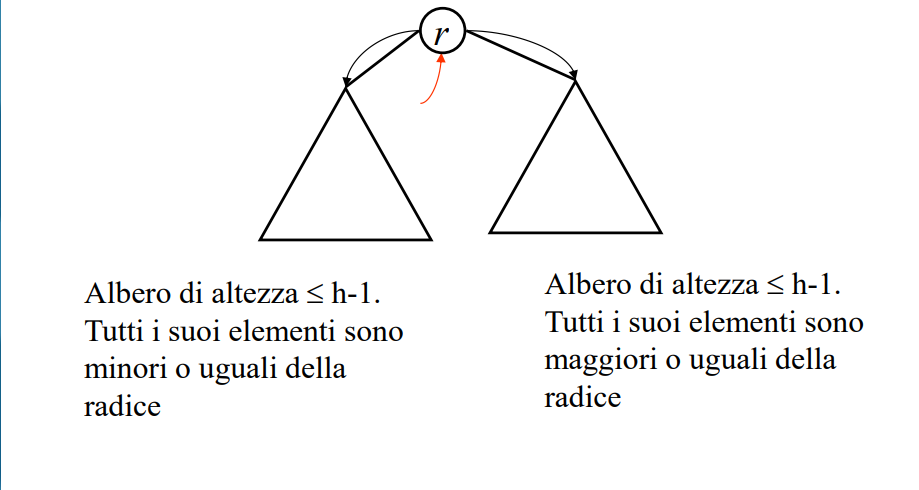

### Search

Search(chiave k) -> elem
Traccia un cammino nell'albero partendo dalla radice: su ogni nodo, usa la proprietà di ricerca per decidere se proseguire nel sottoalbero sinistro o destro.

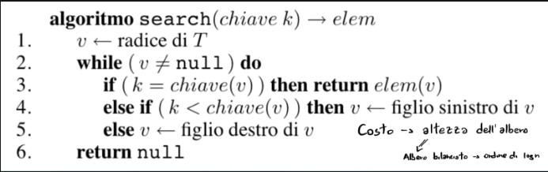

### Insert 

Insert(elem e, chiave k)
*Idea*: aggiunge la nuova chiave come nodo foglia, per capire dove mettere la foglia simula una ricerca con la chiave da inserire.

1.  Crea un nuovo nodo u con elem = e e chiave = k.
2. Cerca la chiave k nell'albero, identificando così il nodo v che diventerà padre di u.
3. Appende u come figlio sinistro/destro di v in modo che sia mantenuta la proprietà di ricerca.

*Correttezza*:
Se seguo questo schema l'elemento *e* viene posizionato nella posizione giusta.
Infatti, per costruzione, ogni antenato di *e* si ritrova *e* nel giusto sottoalbero.

### Cancellazione

La cancellazione è un'operazione difficile, se cancellassimo un nodo qualunque basterebbe cercare tale nodo, spostare i puntatori dei nodi precedenti e successivi. Sarabbe più difficile cancellare la radice, in quel caso andrebbero traslati i sottorami e riordinati.

Per questo è utile implementare delle operazioni ausiliari:
- Massimo
- Minimo
- Predecessore
- Successore

#### Ricerca del massimo / minimo

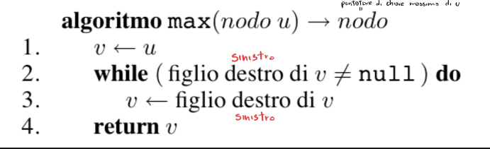

*Nota*: è possibile definire una procedura *min (nodo u)* in maniera del tutto analoga.

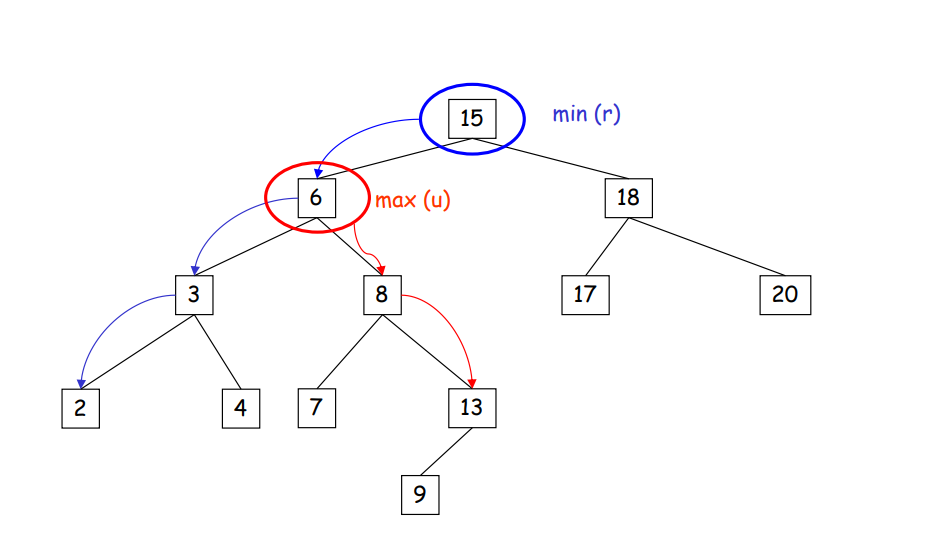

#### Predecessore e Successore
- Il *predecessore* di un nodo *u* in un BST è il nodo *v* nell'albero avente massima chiave $\leq$ chiave(u).
- Il *successore* di un nodo *u* in un BST è il nodo *v* nell'albero avente minima chiave $\geq$ chiave(u).
- Come trovo il predecessore/successore di un nodo in un BST?

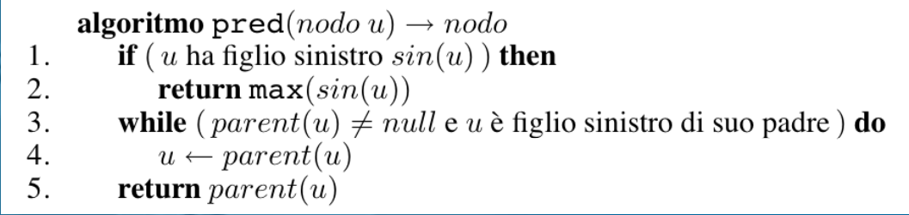

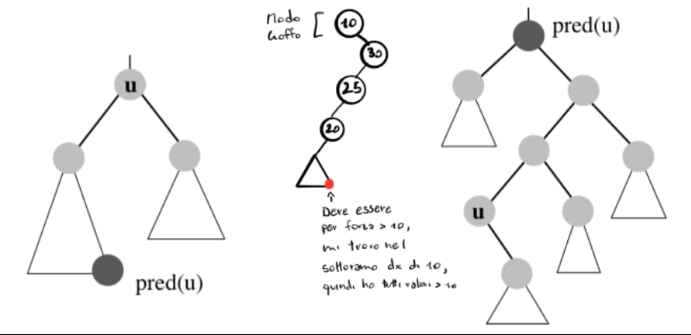

Nota: la ricerca del *successore* di un nodo è simmetrica

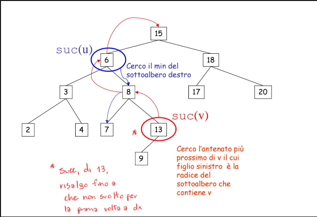

### Delete

Delete(elem e)
Sia *u* il nodo contenente l'elemento "*e*" da cancellare:
1. u è una foglia: rimuovila
2. u ha un solo figlio:
	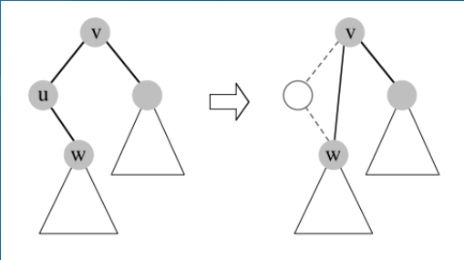
	Basta traslare *w* al posto di *u*, se *u* ha un **solo figlio** -> Costo Costante

3. *u* ha due figli: sostituiscilo con il predecessore (o successore) (v) e rimuovi fisicamente il predecessore (o successore) (che ha al più un figlio).

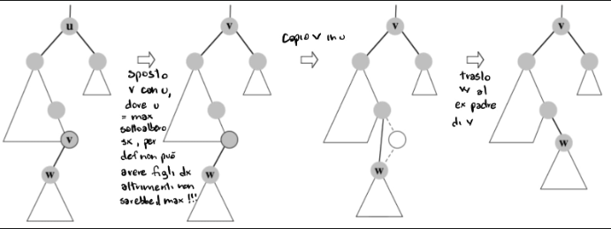

- Nella 3. prelevo il massimo fra i nodi minori di *u*: *w* , lo sostituisco con con la radice, mantenendo così la proprietà del BST (nodi sx $\leq$  della radice, nodi dx >radice). Al posto di *w* riattacco i suoi figli.

### Costo delle operazioni

- Tutte le operazioni hanno costo O(h), dove h è l'altezza dell'albero.

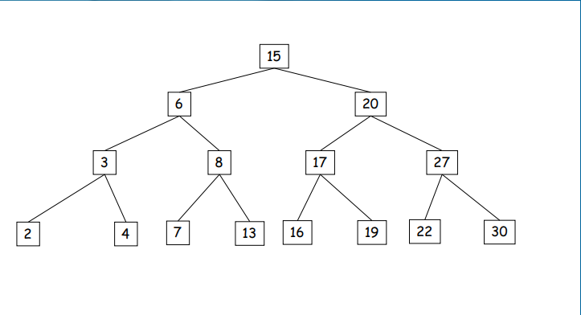

- O(n) nel caso peggiore (alberi molo sbilanciati e profondi).
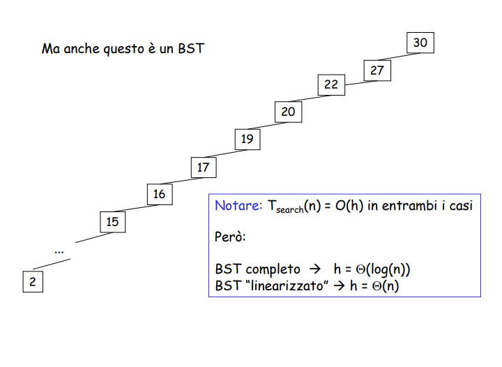

### Definizioni AVL

*Fattore di bilanciamento $\beta (v)$* di un nodo v = altezza del sottoalbero sinistro di v - altezza del sottoalbero destro di v. 

Un albero si dice *bilanciato in altezza* se ogni nodo v ha fattore di bilanciamento in valore assoluto $\leq$ 1.

**Alberi AVL = alberi binari di riicerca bilanciati in altezza.**

Generalmente $\beta (v)$ mantenuto come informazione addizionale nel record relativo a v.

Il seguente albero è un AVL

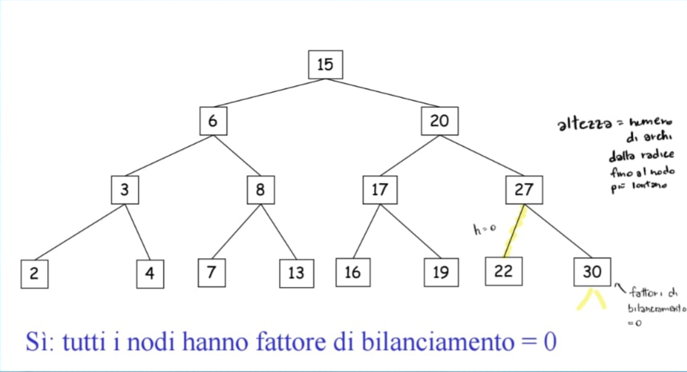

*Il seguente albero NON è un AVL*

Il fattore di bilanciamento = $h_{sx} -h_{dx}$ , per convenzione l'altezza di albero vuoto è pari a -1. 
Questo albero non è un AVL perchè ad ogni livello non si decrementa mai, per via dei rami vuoti a dx. Quindi si arriverà alla radice con valori positivi $\geq$ 1.

*Il seguente albero è un AVL*

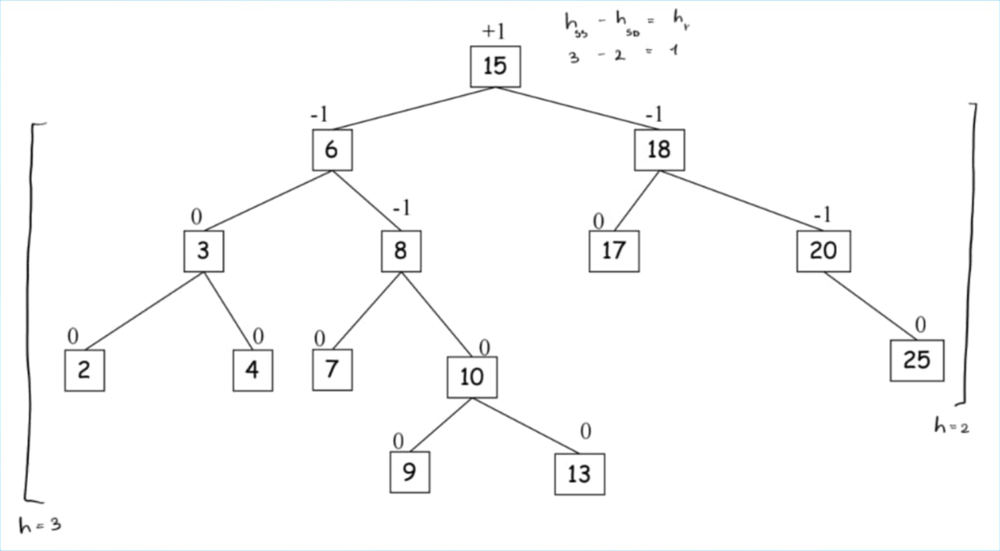

 Viene rispettata la proprietà sui fattori di bilanciamento.

### Altezza di alberi AVL 
Si può dimostrare che *un albero AVL con n nodi ha altezza O(log n)*

*Idea della dimostrazione*: considerare, tra tutti gli AVL, i più sbilanciati.

*albero di FIbonacci di altezza h*:
albero AVL di altezza h con il minimo numero di nodi $n_{h}$

minimizzare # nodi fissata l'altezza $\equiv$  massimizzare altezza fissato # nodi

*Intuizione*: se gli alberi di Fibonacci hanno altezza O(log n), allora tutti gli alberi AVL hanno altezza O(log n).

#### Come è fatto un albero di Fibonacci di altezza 2?

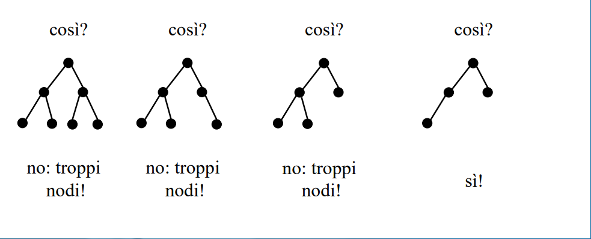

*Infatti*: se togliamo ancora un nodo, o diventa sbilanciato, o cambia la sua altezza
*Nota*: ogni nodo (non foglia) ha fattore di bilanciamento pari (in valore assoluto) a 1.

#### Alberi di Fibonacci per valori piccoli di altezza...

$T_{i}$: albero di Fibonacci di altezza i
	(albero AVL di altezza i con il minimo numero di nodi)
	
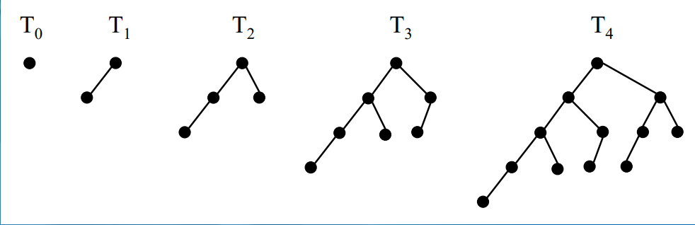

*Nota che*: se a $T_{i}$ tolgo un nodo, o diventa sbilanciato, o cambia la sua altezza
*Inoltre*: ogni nodo (non foglia) ha fattore di bilanciamento pari (in valore assoluto) a 1.

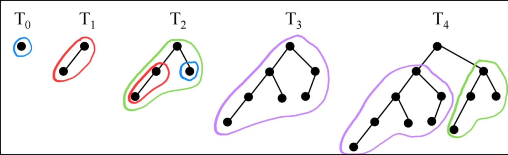

*Lo schema*
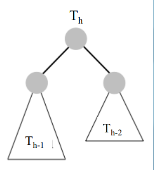

*Lemma* 
Sia $n_{h}$ il numero di nodi di $T_{h}$.
Risulta $n_{h} = F_{h+3}-1$ dove $F_{i} : i$ - esimo numero di fibonacci

   *dim* 
   per induzione su h si usa $n_{h} = 1 + n_{h-1} + n_{h-2}$, sommo la radice con il sottoramo sx e il sottoramo dx.

*Corollario*
Un albero AVL con n nodi ha altezza h=O(log n)

   *dim* 
   $n_{h}= F_{h+3} -1 = \Theta(\phi ^{h})$  
	   $\Downarrow$
   h=$\Theta(log n_{h})$ = O(log n)
   	  |
   	  |
   	 $n_h \leq n$ 

   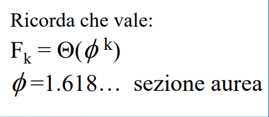

#### Posso usare un albero AVL per implementare un dizionario?

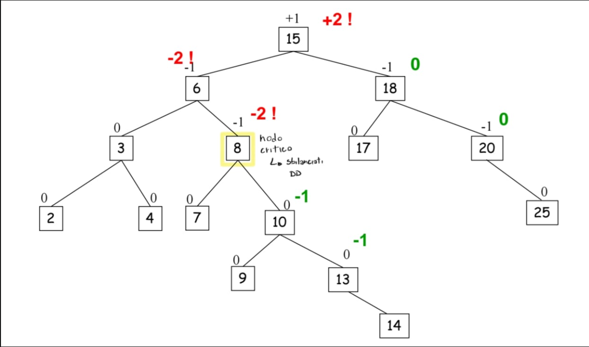

come implemento *Insert(14)*? e *delete(25)*?

*Domanda*:
Di *quanto* e *quali* fattori di bilanciamento *cambiano* a fronte di un inserimento/cancellazione?

**Se parto da un albero AVL** e inserisco/cancello un nodo:
- (*quali*) cambiano solo i fattori di bilanciamento dei nodi lungo il cammino radice-nodo inserito/cancellato.
- (*quanto*) i fattori di bilanciamento cambiano di +/- 1

### Implementazione delle operazioni

- L'operazione search procede come in un BST
- Inserimenti e cancellazioni potrebbero sbilanciare l'albero

$\Rightarrow$ Manteniamo il bilanciamento tramite opportune *rotazioni*

#### Rotazione di base verso *destra*/*sinistra* sul nodo *v*/*u*

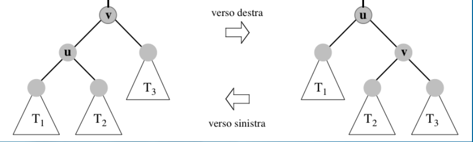

- Mantiene la proprietà di ricerca
- Richiede tempo O(1) 

#### Ribilanciamento tramite rotazioni

- Le rotazioni sono effettuate su nodi sbilanciati.
- Sia v un nodo di profondità massima (nodo *critico*) con fattore di bilanciamento $\beta(v)$ +2,-2
- Esiste un sottoalbero T di v che lo sbilancia 
- A seconda della posizione di T si hanno 4 casi:

 Sinistra - sinistra (SS)      T è il sottoalbero sinistro del figlio sinistro di v
 Destra - destra (DD)        T è il sottoalbero destro del figlio destro di v
 Sinistra - destra (SD)       T è il sottoalbero destro del figlio sinistro di v
 Destra - sinistra (DS)       T è il sottoalbero sinistro del figlio destro di v

- I quattro casi sono simmetrici a coppie

#### Caso SS
Sia h l'altezza del sottoalbero destro di v

- L'altezza di T(v) è *h+3*, l'altezza di T(u) è *h+2*, l'altezza di $T_{3}$ è *h* e l'altezza di $T_1$ è *h+1* $\Rightarrow$ $\beta(v)$ = +2 e lo sbilanciamento è provocato da $T_1$ 

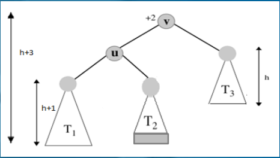

- Si applica una rotazione semplice verso destra su *v*  (e i fattori di bilanciamento di tutti i nodi torneranno ok).
- 2 sottocasi possibili:
	- (i) l'altezza di $T_2$ è h $\Rightarrow$ l'altezza dell'albero coinvolto nella rotazione passa da *h+3* a *h+2* 
	- (ii) l'altezza di $T_3$ è h+1 $\Rightarrow$ l'altezza dell'albero coinvolto nella rotazione rimane pari a *h+3*

I due sottocasi del caso SS: 

![Caso 1][image-78.png]

![Caso 2][image-80.png]

##### Osservazioni sul caso SS

- *Dopo* la *rotazione* l'albero è *bilanciato* (tutti i fattori di bilanciamento sono in modulo $\leq$ 1)
- L' *inserimento* di un elemento nell'AVL (ovvero, l'aggiunta di una *foglia* a un albero bilanciato) può provocare solo il sottocaso (i) (perché altrimenti l'AVL era già sbilanciato).
- La *cancellazione* di un elemento dall'AVL (che necessariamente fa diminuire l'altezza di qualche sottoalbero) può provocare entrambi i casi (ad esempio, se cancellando un elemento ho abbassato l'altezza di $T_3$) 
- Nel caso (i), dopo la rotazione, l'albero diminuisce la sua altezza di uno

#### Caso SD
Sia h l'altezza del sottoalbero destro di v

- $\Rightarrow$ altezza di T(w) = h+1
- $\beta(v)$=+2 e sbilanciamento è provocato dal sottoalbero destro di *z*

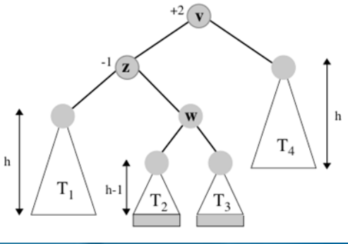

- Applicare *due rotazioni* semplici: una *verso sinistra* sul *figlio sinistro* del *nodo critico* (nodo z), l'altra *verso destra* sul *nodo critico* (nodo v)

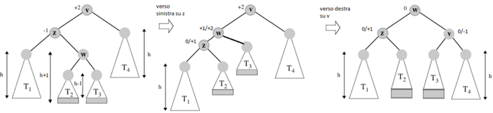

- I fattori di bilanciamento di tutti i nodi tornano ok
- L' altezza dell'albero dopo la rotazione passa da *h+3* a *h+2* 
- Il caso SD può essere provocato sia da inserimenti (in $T_2$ o $T_3$), sia da cancellazioni che abbassano di *1* l'altezza di $T_4$.

### Insert(elem e, chiave k)

1. Crea un nuovo *u* con elem=e e chiave=k
2. Inserisci *u* come in un BST
3. Ricalcola i fattori di bilanciamento dei nodi nel cammino della radice a *u*: sia *v* il più profondo nodo con fattore di bilanciamento pari a +- 2 (*nodo critico*) 
4. Esegui una rotazione opportuna su *v* 

*Oss*: un solo ribilanciamento è sufficiente, poichè l'altezza dell'albero coinvolto diminuisce di 1 (sottocaso (i) del caso SS o DD, o casi SD o DS), e quindii torna ad essere *uguale* all'altezza che aveva *prima dell'inserimento*. 

#### Esempio: insert (10,e)

![Prima][image-84.png]
![Dopo][image-83.png]

### Delete(elem e)

1. Cancella il nodo come in un BST
2. Ricalcola il fattore di bilanciamento del *padre del nodo eliminato fisicamente* (che potrebbe essere diverso dal nodo contenente *e*), ed esegui l'opportuna rotazione semplice o doppia ove necessario.
3. Ripeti questo passo, sino ad arrivare eventualmente alla radice dell'AVL: 
	- Se h del sottoalbero appena ribilanciato = h prima della cancellazione, termina. Invece, se h è diminuita, risali verso l'alto (fino al padre del sottoalbero appena ribilanciato), calcola il fattore di bilanciamento, e applica l'opportuno ribilanciamento.

*Oss*: potrebbero essere necessarie *O(log n)* rotazioni: infatti eventuali diminuzioni di altezza indotte dalle rotazioni possono propagare lo sbilanciamento verso l'alto nell'albero (l'altezza del sottoalbero in cui è avvenuta la rotazione *diminuisce di 1* rispetto a quella che aveva *prima della cancellazione* )

![Prima][image-85.png]

![Dopo][image-87.png]

### Cancellazione con rotazioni a cascata 

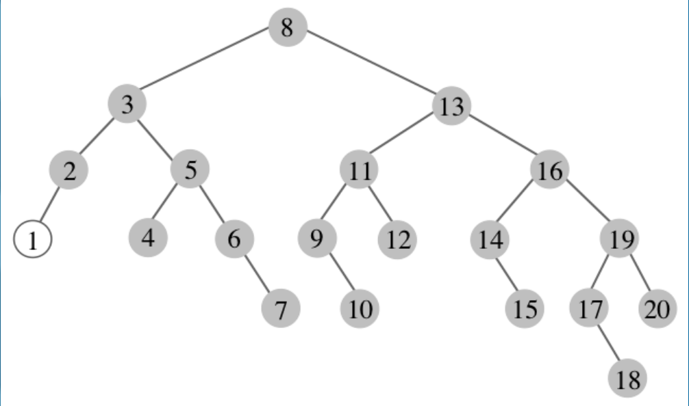

#### Costo delle operazioni
Tutte le operazioni hanno costo *O (log n)* poiché l'altezza dell'albero è O(log n) e ciascuna rotazione richiede solo tempo costante.

### Classe AlberoAVL

![BST esteso con AVL][image-89.png]

#### Dettagli importanti 

Nell'analisi della complessità dell'operazione di *insert/delete* abbiamo implicitamente usato le seguenti tre proprietà:

(i) dato un nodo *v*, è possibile conoscere $\beta(v)$ in tempo O(1)
(ii) dopo aver inserito/cancellato un nodo *v* nell'albero come se fosse un semplice BST, è possibile 
