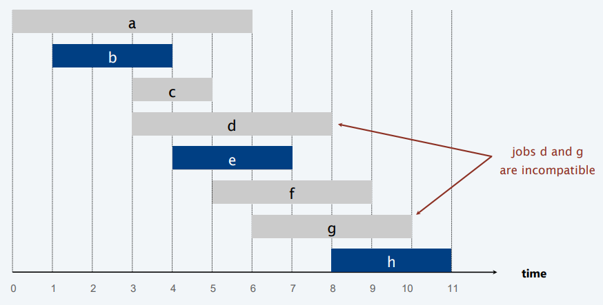
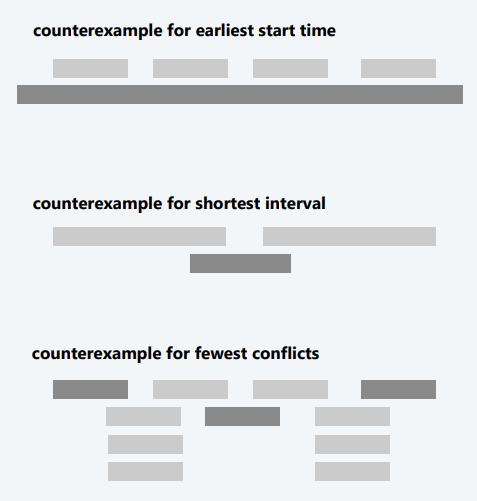

## Interval Scheduling

- Ogni task *j* inizia in $s_j$ e finisce in $f_j$ 
- Due task si dicono *compatibili* se non si sovrappongono
- Obiettivo: trovare il massimo sottoinsieme di task reciprocamente compatibili 

**Input**: 
- Un insieme di n intervalli $I_1$, .... , $I_n$ 
- Un intervallo $I_i$ ha un tempo di inzio $s_i$ e un tempo di fine $f_i$ 

**Soluzione fattibile**:
- Un sottoinsieme S di intervalli che sono reciprocamente compatibili, cioé                       per ogni $I_i$ , $I_j$ $\in$ S $I_i$ non si sovrappone con $I_j$ .

**Misurare (per massimizzare)**:
- Numero di intervalli programmati, ovvero cardinalità di S

### Interval Scheduling: Greedy Algorithms

**Modello Greedy**: Consideriamo le task in un ordine naturale. 
Prendiamo ogni task purché sia compatibile con le altre prese in precedenza. 

- [Tempo di inizio più vicino] Consideriamo le task in ordine crescente di $s_j$ .
- [Tempo di fine più vicino] Consideriamo le task in ordine crescente di $f_j$ .
- [Intervallo più corto] Consideriamo le task in ordine crescente di $f_j$ - $s_j$ .
- [Minor numero di conflitti] Per ogni task j, conta il numero di task che sono in conflitto con $c_j$ . Pianifica in ordine crescente di $c_j$ .

**PseudoCodice**: 

EARLIEST-FINISH-TIME-FIRST ( $n$, $s_1$, $s_2$, ...., $s_n$ , $f_1$ ,$f_2$ , ...., $f_n$ )

SORT jobs by finish times and renumber so that $f_1 \leq f_2 \leq ... \leq f_n$  
S <- $\varnothing$  <-- insieme di task scelte  
FOR j = 1 TO  $n$
	IF (task è compatibile con S)
		S <- S $\cup$ { j } 
RETURN S

