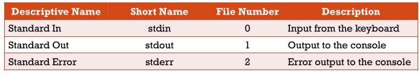
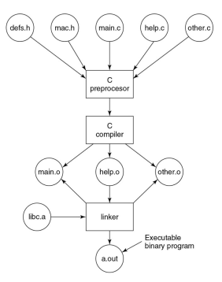
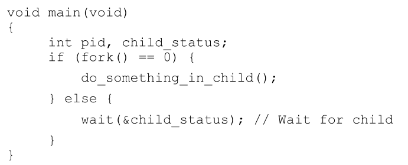
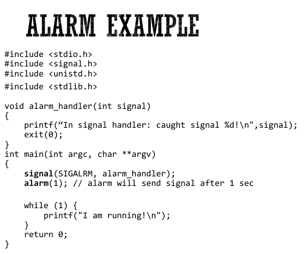

#sistemi_operativi 

C everything is a file

### Hello world (1 of 3) 
Cosa dobbiamo fare per stampare "Hello World" sulla console (output standard) ?
- printf (char * str, ... );
. # int main (int argc, char ** argv)
 {
	 **printf** ("Hello World! \n");
	 return 0;
 }

### Build Process 

### Creazione di processi

### Process management system call

Una shell è un programma

Le funzioni che ci interessando sono:
pid_t fork() = duplica il processo corrente, restituisce il pid del figlio nel chiamante (genitore)
-restituisce 0 nel nuovo processo (figlio), -1 se ha fallito la generazione del figlio

pid_t wait(int * wstatus) = Attende che i processi figli cambino stato
-scrive lo stato in wstatus
-Ad esempio causa una exit o un segnale

int execv (const char * path, char * constargv[]) = Carica un nuovo binario (path) nel processo corrente, rimuovendo tutte le altre mappature di memoria

Come terminare i programmi? 
Ctrl + C, ma come funziona? 
Con i segnali

### Gestione dei segnali

### Comunicazione tra processi attraverso pipe

Open, close, pipe, dup
- int open (const char * pathname, int flags)
	- apre il file specificato dal nome del percorso (pathname)
- int close(int fd)
	- Chiude il descrittore di file specificato fd
- int pipe(int pipefd[2])
	- Crea una pipe con due fd per le sue estremità
- int dup(int oldfd)
	- Crea una copia del descrittore di file oldfd utilizzando il descrittore di file inutilizzato con il numero più basso per la copia

